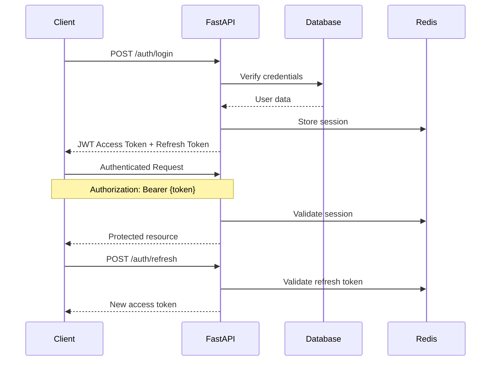

# Authentication API

Secure authentication system using JWT tokens with role-based access control.

## 🔐 Overview

The authentication system provides:

- **JWT Token Authentication** - Secure, stateless authentication
- **Role-Based Access Control** - Four user roles with specific permissions
- **Session Management** - Token refresh and revocation
- **Password Security** - Bcrypt hashing with salt

## 👥 User Roles

| Role                  | Description             | Permissions                                 |
| --------------------- | ----------------------- | ------------------------------------------- |
| `affected_individual` | People seeking help     | Submit requests, view own requests          |
| `volunteer`           | Community volunteers    | View/accept tasks, update status            |
| `first_responder`     | Emergency professionals | All volunteer permissions + priority access |
| `admin`               | System administrators   | Full system access and management           |

## 🔑 Authentication Flow



## 📋 Endpoints

### Register User

Create a new user account.

```http
POST /auth/register
Content-Type: application/json
```

**Request Body:**

```json
{
  "email": "user@example.com",
  "password": "secure_password123",
  "full_name": "John Doe",
  "role": "volunteer",
  "phone_number": "+1234567890"
}
```

**Response (201 Created):**

```json
{
  "id": "550e8400-e29b-41d4-a716-446655440000",
  "email": "user@example.com",
  "full_name": "John Doe",
  "role": "volunteer",
  "phone_number": "+1234567890",
  "is_active": true,
  "created_at": "2025-06-04T10:30:00Z"
}
```

**Validation Rules:**

- Email must be valid and unique
- Password minimum 8 characters
- Role must be one of: `affected_individual`, `volunteer`, `first_responder`, `admin`
- Phone number optional but must be valid format

### Login

Authenticate user and receive JWT tokens.

```http
POST /auth/login
Content-Type: application/json
```

**Request Body:**

```json
{
  "email": "user@example.com",
  "password": "secure_password123"
}
```

**Response (200 OK):**

```json
{
  "access_token": "eyJhbGciOiJIUzI1NiIsInR5cCI6IkpXVCJ9...",
  "refresh_token": "eyJhbGciOiJIUzI1NiIsInR5cCI6IkpXVCJ9...",
  "token_type": "bearer",
  "expires_in": 86400,
  "user": {
    "id": "550e8400-e29b-41d4-a716-446655440000",
    "email": "user@example.com",
    "full_name": "John Doe",
    "role": "volunteer",
    "is_active": true
  }
}
```

### Refresh Token

Get a new access token using refresh token.

```http
POST /auth/refresh
Authorization: Bearer {refresh_token}
```

**Response (200 OK):**

```json
{
  "access_token": "eyJhbGciOiJIUzI1NiIsInR5cCI6IkpXVCJ9...",
  "token_type": "bearer",
  "expires_in": 86400
}
```

### Logout

Revoke current session and tokens.

```http
POST /auth/logout
Authorization: Bearer {access_token}
```

**Response (200 OK):**

```json
{
  "message": "Successfully logged out"
}
```

### Current User

Get current authenticated user information.

```http
GET /auth/me
Authorization: Bearer {access_token}
```

**Response (200 OK):**

```json
{
  "id": "550e8400-e29b-41d4-a716-446655440000",
  "email": "user@example.com",
  "full_name": "John Doe",
  "role": "volunteer",
  "phone_number": "+1234567890",
  "is_active": true,
  "created_at": "2025-06-04T10:30:00Z",
  "last_login": "2025-06-04T15:45:00Z"
}
```

### Update Profile

Update current user profile information.

```http
PUT /auth/profile
Authorization: Bearer {access_token}
Content-Type: application/json
```

**Request Body:**

```json
{
  "full_name": "John Smith",
  "phone_number": "+1987654321"
}
```

**Response (200 OK):**

```json
{
  "id": "550e8400-e29b-41d4-a716-446655440000",
  "email": "user@example.com",
  "full_name": "John Smith",
  "role": "volunteer",
  "phone_number": "+1987654321",
  "is_active": true,
  "updated_at": "2025-06-04T16:00:00Z"
}
```

### Change Password

Change user password.

```http
PUT /auth/password
Authorization: Bearer {access_token}
Content-Type: application/json
```

**Request Body:**

```json
{
  "current_password": "old_password123",
  "new_password": "new_secure_password456"
}
```

**Response (200 OK):**

```json
{
  "message": "Password updated successfully"
}
```

## 🔒 Token Format

### Access Token

JWT payload structure:

```json
{
  "sub": "550e8400-e29b-41d4-a716-446655440000",
  "email": "user@example.com",
  "role": "volunteer",
  "iat": 1717516800,
  "exp": 1717603200,
  "type": "access"
}
```

### Refresh Token

JWT payload structure:

```json
{
  "sub": "550e8400-e29b-41d4-a716-446655440000",
  "iat": 1717516800,
  "exp": 1720108800,
  "type": "refresh"
}
```

**Token Expiration:**

- **Access Token**: 24 hours (86400 seconds)
- **Refresh Token**: 30 days (2592000 seconds)

## 🛡️ Security Features

### Password Requirements

- Minimum 8 characters
- Must contain letters and numbers
- Special characters recommended
- Bcrypt hashing with salt rounds: 12

### Rate Limiting

| Endpoint         | Limit       | Window     |
| ---------------- | ----------- | ---------- |
| `/auth/login`    | 5 attempts  | 15 minutes |
| `/auth/register` | 3 attempts  | 1 hour     |
| `/auth/refresh`  | 10 attempts | 1 hour     |

### Session Management

- Sessions stored in Redis with TTL
- Automatic cleanup of expired sessions
- Concurrent session limit: 5 per user
- Device fingerprinting for security

## 🚫 Error Responses

### Authentication Errors

**Invalid Credentials (401):**

```json
{
  "detail": "Invalid email or password",
  "error_code": "AUTH_INVALID_CREDENTIALS"
}
```

**Token Expired (401):**

```json
{
  "detail": "Token has expired",
  "error_code": "AUTH_TOKEN_EXPIRED"
}
```

**Insufficient Permissions (403):**

```json
{
  "detail": "Insufficient permissions for this operation",
  "error_code": "AUTH_INSUFFICIENT_PERMISSIONS"
}
```

### Validation Errors

**Email Already Exists (400):**

```json
{
  "detail": "Email address already registered",
  "error_code": "AUTH_EMAIL_EXISTS"
}
```

**Weak Password (400):**

```json
{
  "detail": "Password does not meet security requirements",
  "error_code": "AUTH_WEAK_PASSWORD"
}
```

## 💻 Client Integration

### JavaScript/TypeScript

```typescript
class AuthService {
  private baseURL = "http://localhost:8000/auth";
  private tokenKey = "disaster_response_token";

  async login(email: string, password: string) {
    const response = await fetch(`${this.baseURL}/login`, {
      method: "POST",
      headers: {
        "Content-Type": "application/json",
      },
      body: JSON.stringify({ email, password }),
    });

    if (!response.ok) {
      throw new Error("Login failed");
    }

    const data = await response.json();
    localStorage.setItem(this.tokenKey, data.access_token);
    return data;
  }

  async makeAuthenticatedRequest(url: string, options: RequestInit = {}) {
    const token = localStorage.getItem(this.tokenKey);

    return fetch(url, {
      ...options,
      headers: {
        ...options.headers,
        Authorization: `Bearer ${token}`,
      },
    });
  }

  logout() {
    localStorage.removeItem(this.tokenKey);
  }
}
```

### Python

```python
import requests
from typing import Optional

class DisasterResponseAuth:
    def __init__(self, base_url: str = "http://localhost:8000"):
        self.base_url = base_url
        self.access_token: Optional[str] = None
        self.refresh_token: Optional[str] = None

    def login(self, email: str, password: str) -> dict:
        response = requests.post(
            f"{self.base_url}/auth/login",
            json={"email": email, "password": password}
        )
        response.raise_for_status()

        data = response.json()
        self.access_token = data["access_token"]
        self.refresh_token = data["refresh_token"]
        return data

    def get_headers(self) -> dict:
        if not self.access_token:
            raise ValueError("Not authenticated")

        return {"Authorization": f"Bearer {self.access_token}"}

    def request(self, method: str, endpoint: str, **kwargs) -> requests.Response:
        return requests.request(
            method,
            f"{self.base_url}{endpoint}",
            headers=self.get_headers(),
            **kwargs
        )
```

## 🔧 Configuration

### Environment Variables

```env
# JWT Configuration
JWT_SECRET=your-super-secret-jwt-key-here
JWT_ALGORITHM=HS256
JWT_EXPIRE_MINUTES=1440

# Session Configuration
SESSION_SECRET=your-session-secret
SESSION_EXPIRE_HOURS=24

# Rate Limiting
RATE_LIMIT_ENABLED=true
RATE_LIMIT_STORAGE=redis://localhost:6379/1
```

### FastAPI Dependency

```python
from fastapi import Depends, HTTPException
from fastapi.security import HTTPBearer
from core.auth import verify_token, get_current_user

security = HTTPBearer()

# Protect endpoint with authentication
@app.get("/protected")
async def protected_endpoint(
    current_user = Depends(get_current_user)
):
    return {"user": current_user}

# Protect endpoint with role requirement
@app.get("/admin-only")
async def admin_endpoint(
    current_user = Depends(get_current_user)
):
    if current_user.role != "admin":
        raise HTTPException(403, "Admin access required")
    return {"message": "Admin data"}
```

## 📚 Related Documentation

- [User Management API](users.md) - User CRUD operations
- [WebSocket Authentication](websocket.md) - WebSocket auth setup
- [Environment Configuration](../getting-started/environment.md) - JWT settings

---

Need help with authentication? Check the [Troubleshooting Guide](../troubleshooting.md#authentication-issues).
