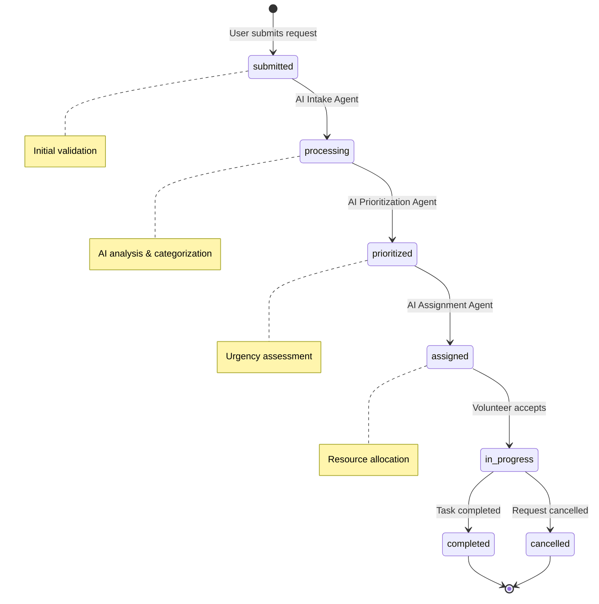

# Emergency Requests API

Manage emergency requests submitted by affected individuals and processed by AI agents.

## 📋 Overview

The Requests API handles the complete lifecycle of emergency requests:

- **Submission** - Affected individuals submit help requests
- **Processing** - AI agents analyze and prioritize requests
- **Assignment** - Automatic assignment to volunteers/responders
- **Updates** - Real-time status updates and communication
- **Resolution** - Request completion and feedback

## 🏗️ Request Lifecycle



## 📋 Request Model

```json
{
  "id": "550e8400-e29b-41d4-a716-446655440000",
  "title": "Medical Emergency - Elderly Person",
  "description": "My elderly neighbor needs immediate medical attention",
  "request_type": "medical",
  "priority": "high",
  "status": "assigned",
  "location": {
    "address": "123 Main St, City, State 12345",
    "latitude": 40.7128,
    "longitude": -74.0060,
    "additional_info": "Apartment 3B, blue building"
  },
  "contact_info": {
    "phone": "+1234567890",
    "email": "user@example.com",
    "preferred_method": "phone"
  },
  "urgency_level": 8,
  "estimated_people_affected": 1,
  "resources_needed": ["medical_supplies", "transportation"],
  "multimedia_attachments": [
    {
      "type": "image",
      "url": "/uploads/emergency-photo-1.jpg",
      "description": "Photo of the situation"
    }
  ],
  "ai_analysis": {
    "category": "medical_emergency",
    "confidence": 0.95,
    "extracted_entities": ["elderly", "medical", "immediate"],
    "risk_assessment": "high_risk",
    "recommended_resources": ["paramedic", "ambulance"]
  },
  "assigned_to": {
    "user_id": "volunteer-123",
    "full_name": "Jane Smith",
    "role": "first_responder",
    "assigned_at": "2025-06-04T10:30:00Z"
  },
  "requester": {
    "user_id": "user-456",
    "full_name": "John Doe",
    "role": "affected_individual"
  },
  "created_at": "2025-06-04T10:15:00Z",
  "updated_at": "2025-06-04T10:30:00Z",
  "resolved_at": null
}
```

## 📋 Endpoints

### Submit Request

Create a new emergency request.

```http
POST /requests
Authorization: Bearer {token}
Content-Type: application/json
```

**Request Body:**

```json
{
  "title": "Medical Emergency - Elderly Person",
  "description": "My elderly neighbor needs immediate medical attention. She fell down and can't get up.",
  "request_type": "medical",
  "location": {
    "address": "123 Main St, City, State 12345",
    "latitude": 40.7128,
    "longitude": -74.0060,
    "additional_info": "Apartment 3B, blue building"
  },
  "contact_info": {
    "phone": "+1234567890",
    "email": "user@example.com",
    "preferred_method": "phone"
  },
  "urgency_level": 8,
  "estimated_people_affected": 1,
  "resources_needed": ["medical_supplies", "transportation"]
}
```

**Response (201 Created):**

```json
{
  "id": "550e8400-e29b-41d4-a716-446655440000",
  "title": "Medical Emergency - Elderly Person",
  "status": "submitted",
  "priority": "pending",
  "created_at": "2025-06-04T10:15:00Z",
  "ai_processing_started": true,
  "estimated_response_time": "5-10 minutes"
}
```

### Get All Requests

Retrieve requests with filtering and pagination.

```http
GET /requests?status=assigned&priority=high&limit=10&offset=0
Authorization: Bearer {token}
```

**Query Parameters:**

| Parameter | Type | Description | Default |
|-----------|------|-------------|---------|
| `status` | string | Filter by status | all |
| `priority` | string | Filter by priority | all |
| `request_type` | string | Filter by type | all |
| `assigned_to` | string | Filter by assignee ID | all |
| `requester` | string | Filter by requester ID | all |
| `created_after` | datetime | Filter by creation date | none |
| `created_before` | datetime | Filter by creation date | none |
| `limit` | integer | Items per page (max 100) | 20 |
| `offset` | integer | Page offset | 0 |
| `sort` | string | Sort field | created_at |
| `order` | string | Sort order (asc/desc) | desc |

**Response (200 OK):**

```json
{
  "requests": [
    {
      "id": "550e8400-e29b-41d4-a716-446655440000",
      "title": "Medical Emergency - Elderly Person",
      "status": "assigned",
      "priority": "high",
      "request_type": "medical",
      "urgency_level": 8,
      "created_at": "2025-06-04T10:15:00Z",
      "assigned_to": {
        "user_id": "volunteer-123",
        "full_name": "Jane Smith",
        "role": "first_responder"
      }
    }
  ],
  "total": 45,
  "limit": 10,
  "offset": 0,
  "has_next": true,
  "has_prev": false
}
```

### Get Request Details

Retrieve detailed information about a specific request.

```http
GET /requests/{request_id}
Authorization: Bearer {token}
```

**Response (200 OK):**

```json
{
  "id": "550e8400-e29b-41d4-a716-446655440000",
  "title": "Medical Emergency - Elderly Person",
  "description": "My elderly neighbor needs immediate medical attention",
  "request_type": "medical",
  "priority": "high",
  "status": "in_progress",
  "location": {
    "address": "123 Main St, City, State 12345",
    "latitude": 40.7128,
    "longitude": -74.0060
  },
  "ai_analysis": {
    "category": "medical_emergency",
    "confidence": 0.95,
    "risk_assessment": "high_risk"
  },
  "timeline": [
    {
      "timestamp": "2025-06-04T10:15:00Z",
      "event": "request_submitted",
      "description": "Request submitted by John Doe"
    },
    {
      "timestamp": "2025-06-04T10:17:00Z",
      "event": "ai_processing_completed",
      "description": "AI analysis completed - High priority medical emergency"
    },
    {
      "timestamp": "2025-06-04T10:30:00Z",
      "event": "assigned",
      "description": "Assigned to Jane Smith (First Responder)"
    },
    {
      "timestamp": "2025-06-04T10:35:00Z",
      "event": "status_update",
      "description": "Responder en route to location"
    }
  ],
  "messages": [
    {
      "id": "msg-1",
      "sender": "Jane Smith",
      "message": "I'm on my way. ETA 5 minutes.",
      "timestamp": "2025-06-04T10:35:00Z"
    }
  ]
}
```

### Update Request Status

Update the status of an existing request.

```http
PUT /requests/{request_id}/status
Authorization: Bearer {token}
Content-Type: application/json
```

**Request Body:**

```json
{
  "status": "in_progress",
  "notes": "Responder arrived on scene",
  "estimated_completion": "2025-06-04T11:30:00Z"
}
```

**Response (200 OK):**

```json
{
  "id": "550e8400-e29b-41d4-a716-446655440000",
  "status": "in_progress",
  "updated_at": "2025-06-04T10:45:00Z",
  "updated_by": {
    "user_id": "volunteer-123",
    "full_name": "Jane Smith"
  }
}
```

### Assign Request

Assign a request to a volunteer or first responder.

```http
POST /requests/{request_id}/assign
Authorization: Bearer {token}
Content-Type: application/json
```

**Request Body:**

```json
{
  "assignee_id": "volunteer-123",
  "notes": "Best match based on location and skills"
}
```

**Response (200 OK):**

```json
{
  "id": "550e8400-e29b-41d4-a716-446655440000",
  "status": "assigned",
  "assigned_to": {
    "user_id": "volunteer-123",
    "full_name": "Jane Smith",
    "role": "first_responder",
    "distance_km": 2.3,
    "eta_minutes": 8
  },
  "assigned_at": "2025-06-04T10:30:00Z"
}
```

### Add Message

Add a message/update to a request.

```http
POST /requests/{request_id}/messages
Authorization: Bearer {token}
Content-Type: application/json
```

**Request Body:**

```json
{
  "message": "Patient has been stabilized and is being transported to hospital",
  "message_type": "status_update",
  "visibility": "all"
}
```

**Response (201 Created):**

```json
{
  "id": "msg-5",
  "message": "Patient has been stabilized and is being transported to hospital",
  "sender": {
    "user_id": "volunteer-123",
    "full_name": "Jane Smith",
    "role": "first_responder"
  },
  "timestamp": "2025-06-04T11:15:00Z",
  "message_type": "status_update"
}
```

### Upload Attachment

Add multimedia attachments to a request.

```http
POST /requests/{request_id}/attachments
Authorization: Bearer {token}
Content-Type: multipart/form-data
```

**Form Data:**

- `file`: Image/video file (max 10MB)
- `description`: Description of the attachment
- `attachment_type`: Type of attachment (image/video/document)

**Response (201 Created):**

```json
{
  "id": "att-1",
  "filename": "emergency-photo.jpg",
  "url": "/uploads/requests/550e8400-e29b-41d4-a716-446655440000/emergency-photo.jpg",
  "type": "image",
  "size": 2048576,
  "description": "Photo showing the emergency situation",
  "uploaded_at": "2025-06-04T10:20:00Z"
}
```

### Get Request Statistics

Get statistical overview of requests.

```http
GET /requests/stats?period=24h
Authorization: Bearer {token}
```

**Query Parameters:**

- `period`: Time period (1h, 24h, 7d, 30d)
- `group_by`: Group by field (status, priority, type, hour, day)

**Response (200 OK):**

```json
{
  "total_requests": 150,
  "period": "24h",
  "breakdown": {
    "by_status": {
      "submitted": 25,
      "processing": 10,
      "assigned": 35,
      "in_progress": 40,
      "completed": 35,
      "cancelled": 5
    },
    "by_priority": {
      "critical": 5,
      "high": 25,
      "medium": 70,
      "low": 50
    },
    "by_type": {
      "medical": 45,
      "rescue": 30,
      "shelter": 25,
      "supplies": 35,
      "transportation": 15
    }
  },
  "response_times": {
    "average_assignment_time": 8.5,
    "average_completion_time": 45.2
  }
}
```

## 🤖 AI Processing

### Request Analysis

When a request is submitted, AI agents process it:

1. **Intake Agent** - Validates and enriches request data
2. **Prioritization Agent** - Assigns priority and urgency
3. **Assignment Agent** - Finds best responder match
4. **Communication Agent** - Sends notifications

### AI Analysis Fields

```json
{
  "ai_analysis": {
    "category": "medical_emergency",
    "confidence": 0.95,
    "extracted_entities": [
      {"type": "person", "value": "elderly neighbor"},
      {"type": "condition", "value": "fell down"},
      {"type": "urgency", "value": "immediate"}
    ],
    "risk_assessment": "high_risk",
    "recommended_resources": ["paramedic", "ambulance"],
    "similar_cases": ["case-123", "case-456"],
    "processing_time": 2.3,
    "agent_notes": "High priority medical case requiring immediate response"
  }
}
```

## 🔍 Search and Filtering

### Advanced Search

```http
GET /requests/search?q=medical emergency&location=nearby&radius=5km
Authorization: Bearer {token}
```

**Query Parameters:**

- `q`: Free text search
- `location`: Search near location (coordinates or address)
- `radius`: Search radius (km)
- `skills`: Required skills/resources
- `availability`: Responder availability filter

### Geospatial Queries

```http
GET /requests/nearby?lat=40.7128&lng=-74.0060&radius=10
Authorization: Bearer {token}
```

Find requests within specified radius of coordinates.

## 🚨 Real-time Updates

### WebSocket Events

Requests emit real-time events via WebSocket:

```json
{
  "event": "request_updated",
  "data": {
    "request_id": "550e8400-e29b-41d4-a716-446655440000",
    "status": "in_progress",
    "updated_by": "volunteer-123",
    "timestamp": "2025-06-04T10:45:00Z"
  }
}
```

### Event Types

- `request_created` - New request submitted
- `request_updated` - Status or details changed
- `request_assigned` - Assigned to responder
- `request_message` - New message added
- `request_completed` - Request resolved

## 🔒 Permissions

### Role-Based Access

| Operation | Affected Individual | Volunteer | First Responder | Admin |
|-----------|-------------------|-----------|-----------------|-------|
| Create request | ✅ | ✅ | ✅ | ✅ |
| View own requests | ✅ | - | - | ✅ |
| View assigned requests | - | ✅ | ✅ | ✅ |
| View all requests | - | - | ✅ | ✅ |
| Update status | - | ✅ | ✅ | ✅ |
| Assign requests | - | - | ✅ | ✅ |
| Delete requests | - | - | - | ✅ |

## 📚 Related APIs

- [Tasks API](tasks.md) - Task management for requests
- [Users API](users.md) - User and responder management  
- [WebSocket API](websocket.md) - Real-time updates
- [AI Agents API](agents.md) - AI processing status

---

Need help with the Requests API? Check the [API Troubleshooting Guide](../troubleshooting.md#api-issues).
