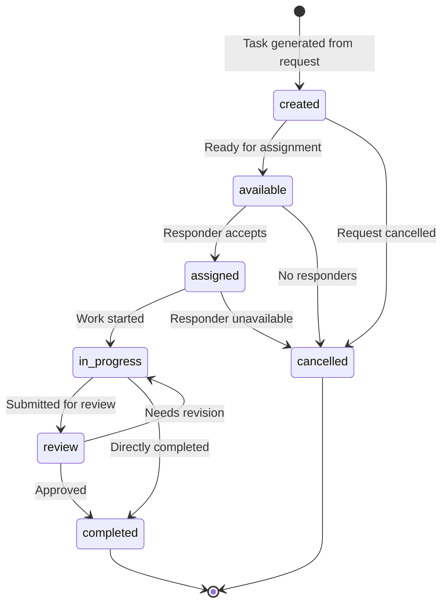

# Tasks API

Manage tasks created from emergency requests and assigned to volunteers and first responders.

## 📋 Overview

The Tasks API handles the operational workflow of disaster response:

- **Task Creation** - Automatic generation from emergency requests
- **Assignment** - AI-powered matching with responders
- **Progress Tracking** - Real-time status updates
- **Resource Management** - Track resource allocation and usage
- **Completion** - Task closure and feedback collection

## 🔄 Task Lifecycle



## 📋 Task Model

```json
{
  "id": "task-550e8400-e29b-41d4-a716-446655440000",
  "title": "Medical Emergency Response - Elderly Care",
  "description": "Provide immediate medical assistance to elderly individual who has fallen",
  "task_type": "medical_response",
  "status": "in_progress",
  "priority": "high",
  "request_id": "550e8400-e29b-41d4-a716-446655440000",
  "assigned_to": {
    "user_id": "responder-123",
    "full_name": "Dr. Jane Smith",
    "role": "first_responder",
    "specializations": ["emergency_medicine", "geriatric_care"],
    "assigned_at": "2025-06-04T10:30:00Z"
  },
  "location": {
    "address": "123 Main St, City, State 12345",
    "latitude": 40.7128,
    "longitude": -74.0060,
    "accessibility_info": "Third floor, elevator available"
  },
  "estimated_duration": 60,
  "actual_duration": null,
  "required_skills": ["emergency_medical", "patient_care"],
  "required_resources": [
    {
      "resource_type": "medical_supplies",
      "items": ["first_aid_kit", "oxygen_tank", "stretcher"],
      "allocated": true,
      "allocation_id": "alloc-789"
    }
  ],
  "contact_info": {
    "primary": "+1234567890",
    "emergency": "+1987654321",
    "notes": "Contact John Doe (neighbor) if patient unresponsive"
  },
  "checklist": [
    {
      "id": "check-1",
      "item": "Assess patient vital signs",
      "completed": true,
      "completed_at": "2025-06-04T10:45:00Z",
      "notes": "Stable vital signs recorded"
    },
    {
      "id": "check-2", 
      "item": "Administer first aid if needed",
      "completed": false,
      "notes": null
    },
    {
      "id": "check-3",
      "item": "Coordinate with emergency services",
      "completed": false,
      "notes": null
    }
  ],
  "progress_updates": [
    {
      "timestamp": "2025-06-04T10:35:00Z",
      "update": "Arrived on scene, patient conscious and responsive",
      "location": "On-site",
      "photo_url": "/uploads/tasks/progress-photo-1.jpg"
    }
  ],
  "ai_guidance": {
    "recommended_actions": [
      "Check for head injuries",
      "Monitor for signs of shock",
      "Document all vital signs"
    ],
    "safety_reminders": [
      "Ensure scene safety before approaching",
      "Use proper lifting techniques"
    ],
    "protocol_reference": "Emergency Response Protocol ERP-001"
  },
  "created_at": "2025-06-04T10:20:00Z",
  "updated_at": "2025-06-04T10:45:00Z",
  "started_at": "2025-06-04T10:35:00Z",
  "completed_at": null,
  "due_date": "2025-06-04T12:00:00Z"
}
```

## 📋 Endpoints

### Get Available Tasks

Retrieve tasks available for assignment.

```http
GET /tasks/available?skills=medical&location=nearby&limit=10
Authorization: Bearer {token}
```

**Query Parameters:**

| Parameter | Type | Description | Default |
|-----------|------|-------------|---------|
| `skills` | array | Required skills filter | all |
| `location` | string | Location preference | all |
| `radius` | integer | Search radius (km) | 50 |
| `priority` | string | Priority filter | all |
| `task_type` | string | Task type filter | all |
| `estimated_duration` | integer | Max duration (minutes) | all |
| `limit` | integer | Results limit | 20 |
| `offset` | integer | Page offset | 0 |

**Response (200 OK):**

```json
{
  "tasks": [
    {
      "id": "task-123",
      "title": "Medical Emergency Response",
      "task_type": "medical_response",
      "priority": "high", 
      "estimated_duration": 60,
      "location": {
        "address": "123 Main St",
        "distance_km": 2.3
      },
      "required_skills": ["emergency_medical"],
      "created_at": "2025-06-04T10:20:00Z",
      "due_date": "2025-06-04T12:00:00Z",
      "match_score": 0.95
    }
  ],
  "total": 15,
  "user_location": {
    "latitude": 40.7128,
    "longitude": -74.0060
  }
}
```

### Accept Task

Accept an available task assignment.

```http
POST /tasks/{task_id}/accept
Authorization: Bearer {token}
Content-Type: application/json
```

**Request Body:**

```json
{
  "estimated_arrival": "2025-06-04T10:45:00Z",
  "notes": "En route with medical equipment",
  "confirm_skills": ["emergency_medical", "patient_care"],
  "confirm_resources": ["first_aid_kit", "oxygen_tank"]
}
```

**Response (200 OK):**

```json
{
  "id": "task-123",
  "status": "assigned",
  "assigned_to": {
    "user_id": "current-user-id",
    "full_name": "Dr. Jane Smith",
    "role": "first_responder"
  },
  "assigned_at": "2025-06-04T10:30:00Z",
  "estimated_arrival": "2025-06-04T10:45:00Z",
  "contact_instructions": "Call primary contact upon arrival"
}
```

### Get My Tasks

Retrieve tasks assigned to current user.

```http
GET /tasks/my-tasks?status=active
Authorization: Bearer {token}
```

**Query Parameters:**

- `status`: Filter by status (active, completed, all)
- `date_from`: Start date filter
- `date_to`: End date filter

**Response (200 OK):**

```json
{
  "active_tasks": [
    {
      "id": "task-123",
      "title": "Medical Emergency Response",
      "status": "in_progress",
      "priority": "high",
      "progress": 60,
      "location": "123 Main St",
      "started_at": "2025-06-04T10:35:00Z",
      "due_date": "2025-06-04T12:00:00Z"
    }
  ],
  "completed_today": 3,
  "total_points_earned": 245
}
```

### Get Task Details

Retrieve detailed information about a specific task.

```http
GET /tasks/{task_id}
Authorization: Bearer {token}
```

**Response (200 OK):**

Returns complete task model as shown above.

### Update Task Progress

Update task progress and status.

```http
PUT /tasks/{task_id}/progress
Authorization: Bearer {token}
Content-Type: application/json
```

**Request Body:**

```json
{
  "status": "in_progress",
  "progress_percentage": 60,
  "completed_checklist_items": ["check-1"],
  "notes": "Patient stabilized, awaiting ambulance",
  "location_update": {
    "latitude": 40.7128,
    "longitude": -74.0060,
    "timestamp": "2025-06-04T10:45:00Z"
  },
  "resource_usage": [
    {
      "resource_id": "first_aid_kit_001",
      "quantity_used": 1,
      "notes": "Used bandages and antiseptic"
    }
  ]
}
```

**Response (200 OK):**

```json
{
  "id": "task-123",
  "status": "in_progress",
  "progress_percentage": 60,
  "updated_at": "2025-06-04T10:45:00Z",
  "next_actions": [
    "Continue monitoring patient",
    "Prepare for ambulance arrival"
  ]
}
```

### Add Progress Photo

Upload progress photos for documentation.

```http
POST /tasks/{task_id}/photos
Authorization: Bearer {token}
Content-Type: multipart/form-data
```

**Form Data:**

- `photo`: Image file (max 5MB)
- `description`: Photo description
- `timestamp`: When photo was taken (optional)

**Response (201 Created):**

```json
{
  "photo_id": "photo-789",
  "url": "/uploads/tasks/task-123/progress-photo-1.jpg",
  "description": "Patient condition after treatment",
  "timestamp": "2025-06-04T10:45:00Z",
  "uploaded_at": "2025-06-04T10:47:00Z"
}
```

### Complete Task

Mark task as completed and provide summary.

```http
POST /tasks/{task_id}/complete
Authorization: Bearer {token}
Content-Type: application/json
```

**Request Body:**

```json
{
  "completion_notes": "Patient successfully treated and transported to hospital",
  "outcome": "successful",
  "duration_minutes": 75,
  "resources_used": [
    {
      "resource_type": "medical_supplies",
      "items_used": ["bandages", "antiseptic", "oxygen_mask"],
      "quantities": [3, 1, 1]
    }
  ],
  "follow_up_required": true,
  "follow_up_notes": "Monitor patient recovery status",
  "feedback": {
    "difficulty_rating": 3,
    "preparation_adequacy": 5,
    "resource_adequacy": 4,
    "suggestions": "Could use additional stretcher equipment"
  }
}
```

**Response (200 OK):**

```json
{
  "id": "task-123",
  "status": "completed",
  "completed_at": "2025-06-04T11:50:00Z",
  "actual_duration": 75,
  "points_earned": 50,
  "completion_summary": {
    "outcome": "successful",
    "resources_consumed": 3,
    "follow_up_id": "follow-456"
  }
}
```

### Request Help

Request assistance or escalate task.

```http
POST /tasks/{task_id}/request-help
Authorization: Bearer {token}
Content-Type: application/json
```

**Request Body:**

```json
{
  "help_type": "additional_responder",
  "urgency": "high",
  "description": "Need additional medical personnel - patient condition deteriorating",
  "skills_needed": ["advanced_life_support"],
  "estimated_response_time": 15
}
```

**Response (200 OK):**

```json
{
  "help_request_id": "help-789",
  "status": "escalated",
  "additional_responders_notified": 3,
  "estimated_arrival": "2025-06-04T11:15:00Z"
}
```

### Get Task Statistics

Get performance statistics for tasks.

```http
GET /tasks/stats?period=30d&user_id=current
Authorization: Bearer {token}
```

**Response (200 OK):**

```json
{
  "period": "30d",
  "total_tasks": 25,
  "completed_tasks": 23,
  "completion_rate": 0.92,
  "average_duration": 45.5,
  "total_points": 1150,
  "performance_metrics": {
    "response_time_avg": 8.2,
    "task_success_rate": 0.96,
    "feedback_rating": 4.7
  },
  "task_types": {
    "medical_response": 12,
    "rescue_operation": 8,
    "supply_delivery": 5
  },
  "recognition": {
    "badges_earned": ["medical_expert", "rapid_responder"],
    "rank": "senior_volunteer",
    "next_badge_progress": 0.7
  }
}
```

## 🤖 AI Task Management

### Intelligent Assignment

AI considers multiple factors for task assignment:

```json
{
  "assignment_factors": {
    "skill_match": 0.95,
    "location_proximity": 0.88,
    "availability": 1.0,
    "workload_balance": 0.92,
    "past_performance": 0.94,
    "resource_access": 0.90
  },
  "overall_match_score": 0.93,
  "confidence": "high",
  "alternative_assignees": ["user-456", "user-789"]
}
```

### Smart Recommendations

```json
{
  "ai_recommendations": {
    "optimal_route": {
      "duration": 12,
      "distance": 3.2,
      "waypoints": ["resource_depot", "task_location"]
    },
    "resource_suggestions": ["portable_defibrillator"],
    "preparation_tips": [
      "Review patient medical history if available",
      "Prepare for potential transport needs"
    ],
    "risk_factors": ["elderly_patient", "potential_fall_injuries"],
    "success_probability": 0.91
  }
}
```

## 🏆 Gamification

### Point System

Tasks award points based on:

- **Complexity**: 10-100 points
- **Urgency**: 1.5x multiplier for high priority
- **Quality**: Bonus points for excellent feedback
- **Speed**: Bonus for quick response

### Achievements

```json
{
  "achievements": [
    {
      "id": "rapid_responder",
      "name": "Rapid Responder",
      "description": "Complete 10 high-priority tasks within 30 days",
      "progress": 8,
      "required": 10,
      "points_reward": 100
    }
  ],
  "current_streak": 5,
  "longest_streak": 12,
  "next_rank": "expert_volunteer"
}
```

## 🔒 Permissions

### Role-Based Task Access

| Operation | Volunteer | First Responder | Admin |
|-----------|-----------|-----------------|-------|
| View available tasks | ✅ | ✅ | ✅ |
| Accept tasks | ✅ | ✅ | ✅ |
| Update progress | ✅ | ✅ | ✅ |
| Request help | ✅ | ✅ | ✅ |
| View all tasks | - | ✅ | ✅ |
| Reassign tasks | - | ✅ | ✅ |
| Override assignments | - | - | ✅ |

## 📱 Mobile Integration

### Offline Support

Tasks can be cached for offline work:

```http
GET /tasks/{task_id}/offline-data
Authorization: Bearer {token}
```

Returns compressed task data with:
- Complete task details
- Offline maps
- Contact information
- Checklist items
- Resource information

## 📚 Related APIs

- [Requests API](requests.md) - Parent emergency requests
- [Resources API](resources.md) - Resource allocation
- [Users API](users.md) - Volunteer management
- [WebSocket API](websocket.md) - Real-time updates

---

Need help with tasks? Check the [Task Management Guide](../user-guides/volunteers.md) and [Troubleshooting](../troubleshooting.md#task-issues).
