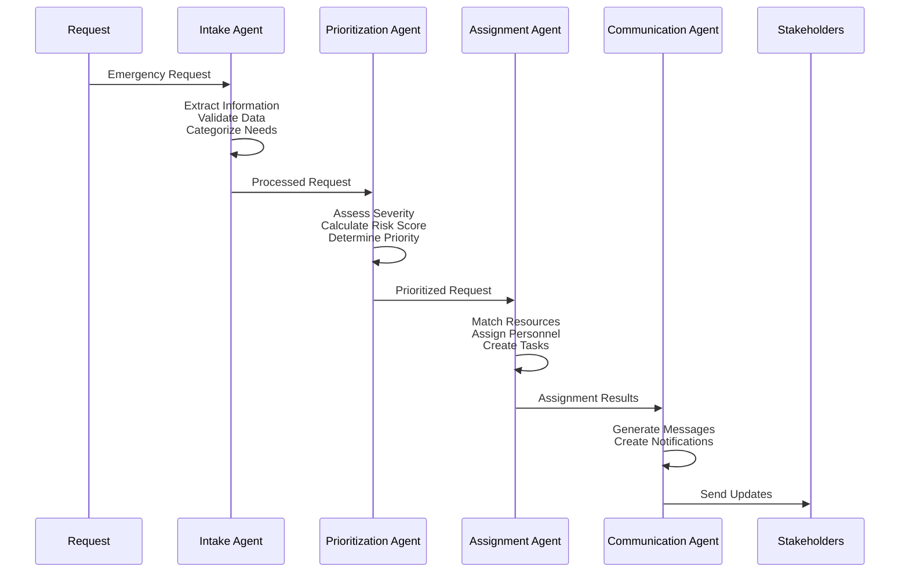
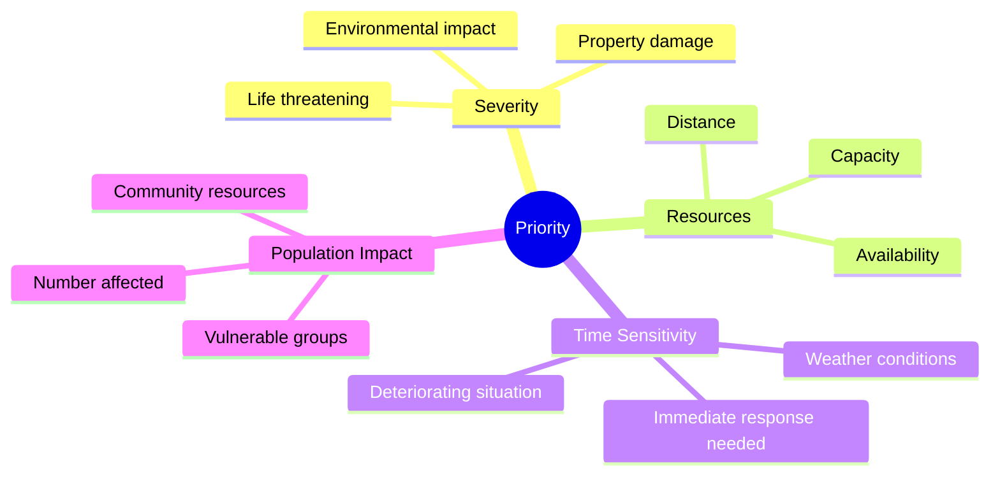
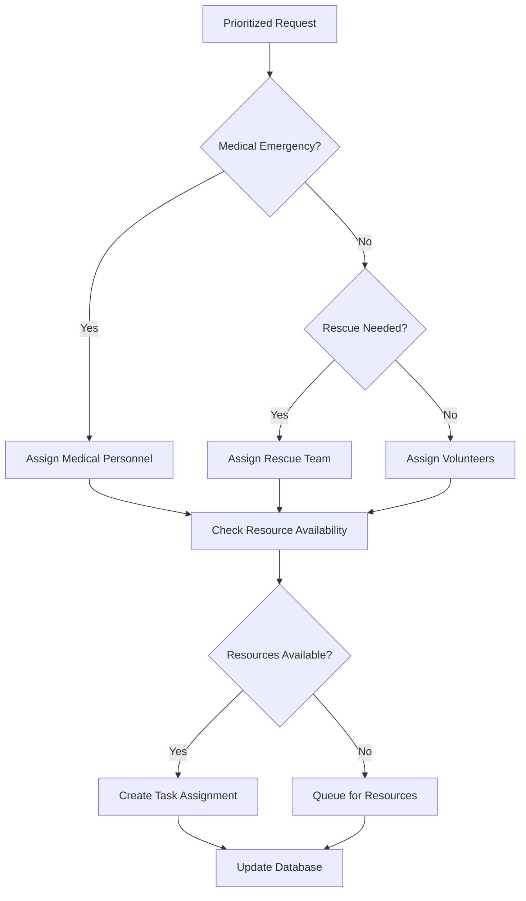
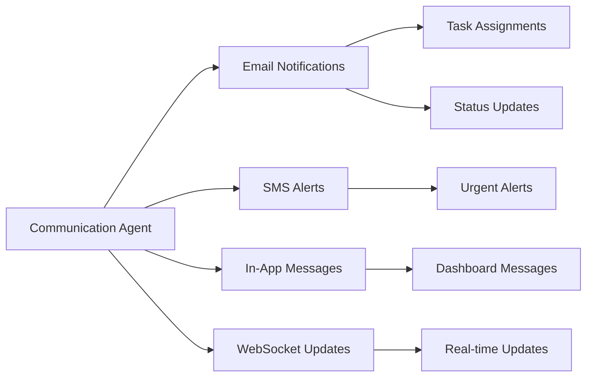
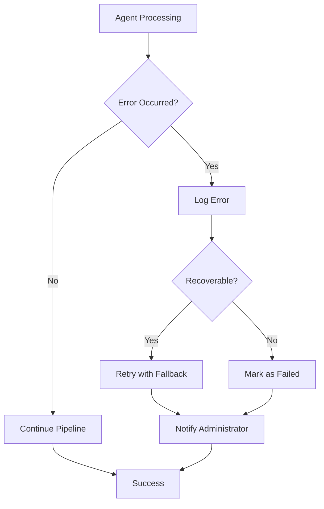

# AI Agents Architecture

The Disaster Response Coordination System uses a multi-agent AI workflow built on the AGNO framework to intelligently process emergency requests.

## 🤖 Agent Workflow Overview



## 🧠 Individual Agents

### 1. Intake Agent

**Purpose**: Process and validate incoming emergency requests

**Technology**:

- AGNO Agent with OpenAI GPT-4o-mini
- Temperature: 0.1 (low for consistent output)
- Max tokens: 1000

**Functions**:

=== "Information Extraction"

    ```python
    def extract_needs(self, description: str) -> List[str]:
        """Extract needs using AI and keyword matching"""
        # AI categorizes into: food, water, medical,
        # shelter, rescue, transport
    ```

=== "Location Processing"

    ```python
    def extract_location(self, text: str) -> Optional[str]:
        """Extract and validate location information"""
        # Uses pattern matching and AI validation
    ```

=== "Urgency Assessment"

    ```python
    def assess_urgency(self, description: str) -> str:
        """Determine urgency level: critical/high/medium/low"""
        # Keyword analysis + AI assessment
    ```

**Input/Output**:

```json
// Input
{
  "title": "Medical emergency downtown",
  "description": "Person collapsed, needs immediate help",
  "location": "Main Street and 1st Ave"
}

// Output
{
  "needs": ["medical", "rescue"],
  "priority": "critical",
  "urgency_level": "critical",
  "extracted_location": "Main Street and 1st Ave",
  "request_type": "medical",
  "confidence_score": 0.95
}
```

### 2. Prioritization Agent

**Purpose**: Assess and prioritize requests based on multiple factors

**Technology**:

- AGNO Agent with OpenAI GPT-4o-mini
- Temperature: 0.2 (low-medium for consistent prioritization)
- Max tokens: 800

**Prioritization Factors**:



**Functions**:

=== "Risk Assessment"

    ```python
    def calculate_priority_factors(self, request: Dict, resources: Dict) -> Dict:
        """Calculate comprehensive risk score"""
        # Considers severity, resources, time, population
    ```

=== "Priority Scoring"

    ```python
    def prioritize_request(self, request: Dict, resources: Dict) -> Dict:
        """AI-powered priority assignment"""
        # Returns priority level and detailed reasoning
    ```

**Priority Matrix**:

| Severity | Resource Availability | Time Sensitivity | Final Priority |
| -------- | --------------------- | ---------------- | -------------- |
| Critical | Available             | Immediate        | CRITICAL       |
| Critical | Limited               | Immediate        | HIGH           |
| High     | Available             | Within 1hr       | HIGH           |
| Medium   | Available             | Within 6hr       | MEDIUM         |
| Low      | Any                   | Non-urgent       | LOW            |

### 3. Assignment Agent

**Purpose**: Match requests with appropriate responders and resources

**Technology**:

- AGNO Agent with OpenAI GPT-4o-mini
- Temperature: 0.3 (medium for balanced assignment)
- Max tokens: 1200

**Assignment Logic**:



**Functions**:

=== "Personnel Matching"

    ```python
    def get_available_personnel(self) -> List[Dict]:
        """Get volunteers and responders by skills/availability"""
        # Skill matching, location proximity, workload
    ```

=== "Resource Allocation"

    ```python
    def get_available_resources(self) -> Dict:
        """Check resource inventory and availability"""
        # Real-time resource tracking
    ```

=== "Task Creation"

    ```python
    def create_assignments(self, requests: List[Dict],
                          personnel: List[Dict],
                          resources: Dict) -> List[Dict]:
        """AI-powered task assignment optimization"""
        # Creates detailed task instructions
    ```

**Assignment Output**:

```json
{
  "assignments": [
    {
      "request_id": "req_123",
      "assignee_id": "volunteer_456",
      "task_title": "Medical Emergency Response",
      "task_description": "Respond to medical emergency at Main St",
      "priority": "critical",
      "estimated_duration": "30 minutes",
      "required_resources": [{ "resource_type": "medical", "quantity": 1 }],
      "special_instructions": "Bring first aid kit",
      "contact_info": "Emergency contact: 911"
    }
  ]
}
```

### 4. Communication Agent

**Purpose**: Handle notifications and status updates

**Technology**:

- AGNO Agent with OpenAI GPT-4o-mini
- Temperature: 0.4 (medium for natural communication)
- Max tokens: 800

**Communication Channels**:



**Functions**:

=== "Message Generation"

    ```python
    def generate_message(self, message_type: str, context: Dict) -> Dict:
        """AI-powered message generation"""
        # Creates appropriate messages for different scenarios
    ```

=== "Multi-channel Delivery"

    ```python
    def send_notification(self, notification: Dict) -> bool:
        """Send notifications via multiple channels"""
        # Email, SMS, in-app, WebSocket
    ```

**Message Types**:

- **Task Assignments**: Clear instructions for volunteers/responders
- **Status Updates**: Progress reports for affected individuals
- **Resource Alerts**: Inventory notifications for administrators
- **System Notifications**: Technical updates and escalations

## 🔄 Agent Coordination

### Coordinator Class

The `AgentCoordinator` orchestrates the entire workflow:

```python
class AgentCoordinator:
    def __init__(self):
        self.intake_agent = IntakeAgent()
        self.prioritization_agent = PrioritizationAgent()
        self.assignment_agent = AssignmentAgent()
        self.communication_agent = CommunicationAgent()

    async def process_incident_pipeline(self, incident_data: Dict) -> Dict:
        """Process through all four agents sequentially"""
        # 1. Intake processing
        # 2. Prioritization assessment
        # 3. Resource assignment
        # 4. Communication dispatch
```

### Error Handling



## 📊 Performance Metrics

The system tracks agent performance:

```python
def get_performance_metrics(self) -> Dict:
    return {
        "total_processed": 1234,
        "success_rate": 0.95,
        "average_response_time": 2.3,  # seconds
        "agent_availability": {
            "intake": True,
            "prioritization": True,
            "assignment": True,
            "communication": True
        }
    }
```

## 🔧 Configuration

### Environment Variables

```bash
# AI Configuration
OPENAI_API_KEY=your-openai-api-key
AGENT_PROCESSING_INTERVAL=30  # seconds
MAX_CONCURRENT_AGENT_TASKS=5

# Performance Tuning
INTAKE_TEMPERATURE=0.1
PRIORITIZATION_TEMPERATURE=0.2
ASSIGNMENT_TEMPERATURE=0.3
COMMUNICATION_TEMPERATURE=0.4
```

### Agent Customization

Each agent can be customized for specific deployment needs:

```python
# Custom temperature and instructions
intake_agent = IntakeAgent(
    temperature=0.05,  # Very low for consistency
    instructions="Custom instructions for specific region"
)
```

## 🚀 Advanced Features

### Batch Processing

```python
async def process_incidents_batch(self, incident_ids: List[str]) -> Dict:
    """Process multiple incidents in parallel"""
    # Optimized for high-volume scenarios
```

### Real-time Monitoring

```python
def get_system_status(self) -> Dict:
    """Real-time agent system status"""
    return {
        "status": "active",
        "active_agents": ["intake", "prioritization", "assignment", "communication"],
        "queue_size": 0,
        "last_activity": "2024-01-15T10:30:00Z"
    }
```

---

Next: [Database Schema](database.md) | [API Design](api.md)
