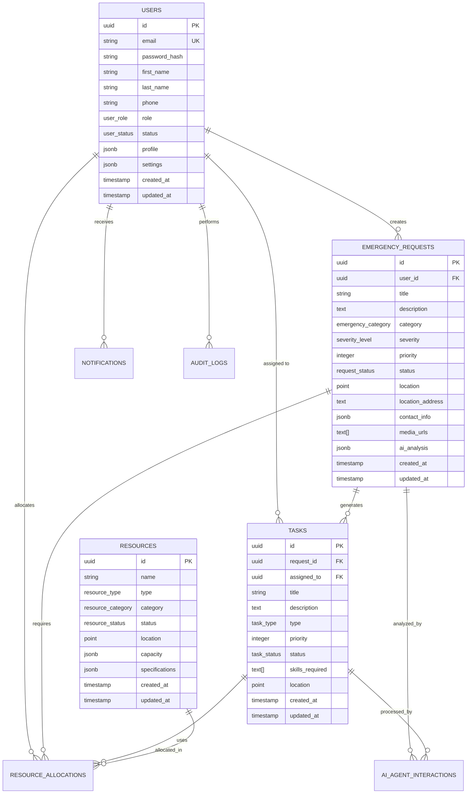

# Database Architecture

This document outlines the database design, schema structure, data relationships, and performance considerations for the disaster response coordination system.

## Database Overview

### Primary Database: PostgreSQL

The system uses PostgreSQL as the primary database for its ACID compliance, advanced features, and excellent performance characteristics.

**Key Features Used:**
- JSONB for flexible document storage
- Full-text search capabilities
- Geographic data types (PostGIS)
- Advanced indexing strategies
- Partitioning for large tables
- Replication for high availability

### Cache Layer: Redis

Redis provides high-performance caching and session storage.

**Use Cases:**
- Session management
- API response caching
- Real-time data caching
- Message queuing
- Rate limiting counters

## Database Schema

### Core Tables

#### Users Table
```sql
CREATE TABLE users (
    id UUID PRIMARY KEY DEFAULT gen_random_uuid(),
    email VARCHAR(255) UNIQUE NOT NULL,
    password_hash VARCHAR(255) NOT NULL,
    first_name VARCHAR(100) NOT NULL,
    last_name VARCHAR(100) NOT NULL,
    phone VARCHAR(20),
    role user_role NOT NULL DEFAULT 'affected_individual',
    status user_status NOT NULL DEFAULT 'active',
    profile JSONB,
    settings JSONB,
    created_at TIMESTAMP WITH TIME ZONE DEFAULT CURRENT_TIMESTAMP,
    updated_at TIMESTAMP WITH TIME ZONE DEFAULT CURRENT_TIMESTAMP,
    last_login TIMESTAMP WITH TIME ZONE,
    email_verified BOOLEAN DEFAULT FALSE,
    email_verified_at TIMESTAMP WITH TIME ZONE
);

-- Indexes
CREATE INDEX idx_users_email ON users(email);
CREATE INDEX idx_users_role ON users(role);
CREATE INDEX idx_users_status ON users(status);
CREATE INDEX idx_users_created_at ON users(created_at);
CREATE INDEX idx_users_profile_gin ON users USING GIN(profile);
```

#### Emergency Requests Table
```sql
CREATE TABLE emergency_requests (
    id UUID PRIMARY KEY DEFAULT gen_random_uuid(),
    user_id UUID NOT NULL REFERENCES users(id),
    title VARCHAR(255) NOT NULL,
    description TEXT NOT NULL,
    category emergency_category NOT NULL,
    severity severity_level NOT NULL,
    priority INTEGER NOT NULL DEFAULT 50,
    status request_status NOT NULL DEFAULT 'pending',
    location POINT NOT NULL,
    location_address TEXT,
    contact_info JSONB,
    media_urls TEXT[],
    ai_analysis JSONB,
    assigned_responders UUID[],
    estimated_resolution TIMESTAMP WITH TIME ZONE,
    actual_resolution TIMESTAMP WITH TIME ZONE,
    resolution_notes TEXT,
    created_at TIMESTAMP WITH TIME ZONE DEFAULT CURRENT_TIMESTAMP,
    updated_at TIMESTAMP WITH TIME ZONE DEFAULT CURRENT_TIMESTAMP
);

-- Indexes
CREATE INDEX idx_emergency_requests_user_id ON emergency_requests(user_id);
CREATE INDEX idx_emergency_requests_category ON emergency_requests(category);
CREATE INDEX idx_emergency_requests_severity ON emergency_requests(severity);
CREATE INDEX idx_emergency_requests_status ON emergency_requests(status);
CREATE INDEX idx_emergency_requests_priority ON emergency_requests(priority DESC);
CREATE INDEX idx_emergency_requests_created_at ON emergency_requests(created_at DESC);
CREATE INDEX idx_emergency_requests_location ON emergency_requests USING GIST(location);
CREATE INDEX idx_emergency_requests_ai_analysis_gin ON emergency_requests USING GIN(ai_analysis);

-- Partitioning by date for performance
CREATE TABLE emergency_requests_2024_01 PARTITION OF emergency_requests
    FOR VALUES FROM ('2024-01-01') TO ('2024-02-01');
```

#### Tasks Table
```sql
CREATE TABLE tasks (
    id UUID PRIMARY KEY DEFAULT gen_random_uuid(),
    request_id UUID NOT NULL REFERENCES emergency_requests(id),
    assigned_to UUID REFERENCES users(id),
    title VARCHAR(255) NOT NULL,
    description TEXT,
    task_type task_type NOT NULL,
    priority INTEGER NOT NULL DEFAULT 50,
    status task_status NOT NULL DEFAULT 'pending',
    skills_required TEXT[],
    location POINT,
    location_address TEXT,
    estimated_duration INTERVAL,
    actual_start_time TIMESTAMP WITH TIME ZONE,
    actual_completion_time TIMESTAMP WITH TIME ZONE,
    completion_notes TEXT,
    rating INTEGER CHECK (rating >= 1 AND rating <= 5),
    feedback TEXT,
    created_at TIMESTAMP WITH TIME ZONE DEFAULT CURRENT_TIMESTAMP,
    updated_at TIMESTAMP WITH TIME ZONE DEFAULT CURRENT_TIMESTAMP,
    deadline TIMESTAMP WITH TIME ZONE
);

-- Indexes
CREATE INDEX idx_tasks_request_id ON tasks(request_id);
CREATE INDEX idx_tasks_assigned_to ON tasks(assigned_to);
CREATE INDEX idx_tasks_status ON tasks(status);
CREATE INDEX idx_tasks_priority ON tasks(priority DESC);
CREATE INDEX idx_tasks_created_at ON tasks(created_at DESC);
CREATE INDEX idx_tasks_deadline ON tasks(deadline);
CREATE INDEX idx_tasks_location ON tasks USING GIST(location);
CREATE INDEX idx_tasks_skills_gin ON tasks USING GIN(skills_required);
```

#### Resources Table
```sql
CREATE TABLE resources (
    id UUID PRIMARY KEY DEFAULT gen_random_uuid(),
    name VARCHAR(255) NOT NULL,
    type resource_type NOT NULL,
    category resource_category NOT NULL,
    status resource_status NOT NULL DEFAULT 'available',
    location POINT NOT NULL,
    location_address TEXT,
    capacity JSONB,
    specifications JSONB,
    current_allocation JSONB,
    availability_schedule JSONB,
    contact_info JSONB,
    maintenance_schedule JSONB,
    last_maintenance TIMESTAMP WITH TIME ZONE,
    next_maintenance TIMESTAMP WITH TIME ZONE,
    created_at TIMESTAMP WITH TIME ZONE DEFAULT CURRENT_TIMESTAMP,
    updated_at TIMESTAMP WITH TIME ZONE DEFAULT CURRENT_TIMESTAMP
);

-- Indexes
CREATE INDEX idx_resources_type ON resources(type);
CREATE INDEX idx_resources_category ON resources(category);
CREATE INDEX idx_resources_status ON resources(status);
CREATE INDEX idx_resources_location ON resources USING GIST(location);
CREATE INDEX idx_resources_capacity_gin ON resources USING GIN(capacity);
CREATE INDEX idx_resources_specifications_gin ON resources USING GIN(specifications);
```

#### Resource Allocations Table
```sql
CREATE TABLE resource_allocations (
    id UUID PRIMARY KEY DEFAULT gen_random_uuid(),
    resource_id UUID NOT NULL REFERENCES resources(id),
    request_id UUID REFERENCES emergency_requests(id),
    task_id UUID REFERENCES tasks(id),
    allocated_by UUID NOT NULL REFERENCES users(id),
    allocation_type allocation_type NOT NULL,
    status allocation_status NOT NULL DEFAULT 'allocated',
    allocated_at TIMESTAMP WITH TIME ZONE DEFAULT CURRENT_TIMESTAMP,
    scheduled_start TIMESTAMP WITH TIME ZONE,
    scheduled_end TIMESTAMP WITH TIME ZONE,
    actual_start TIMESTAMP WITH TIME ZONE,
    actual_end TIMESTAMP WITH TIME ZONE,
    allocation_notes TEXT,
    performance_metrics JSONB,
    created_at TIMESTAMP WITH TIME ZONE DEFAULT CURRENT_TIMESTAMP,
    updated_at TIMESTAMP WITH TIME ZONE DEFAULT CURRENT_TIMESTAMP
);

-- Indexes
CREATE INDEX idx_resource_allocations_resource_id ON resource_allocations(resource_id);
CREATE INDEX idx_resource_allocations_request_id ON resource_allocations(request_id);
CREATE INDEX idx_resource_allocations_task_id ON resource_allocations(task_id);
CREATE INDEX idx_resource_allocations_status ON resource_allocations(status);
CREATE INDEX idx_resource_allocations_allocated_at ON resource_allocations(allocated_at DESC);
```

### Supporting Tables

#### Notifications Table
```sql
CREATE TABLE notifications (
    id UUID PRIMARY KEY DEFAULT gen_random_uuid(),
    user_id UUID NOT NULL REFERENCES users(id),
    type notification_type NOT NULL,
    channel notification_channel NOT NULL,
    title VARCHAR(255) NOT NULL,
    message TEXT NOT NULL,
    data JSONB,
    status notification_status NOT NULL DEFAULT 'pending',
    sent_at TIMESTAMP WITH TIME ZONE,
    delivered_at TIMESTAMP WITH TIME ZONE,
    read_at TIMESTAMP WITH TIME ZONE,
    retry_count INTEGER DEFAULT 0,
    error_message TEXT,
    created_at TIMESTAMP WITH TIME ZONE DEFAULT CURRENT_TIMESTAMP
);

-- Indexes
CREATE INDEX idx_notifications_user_id ON notifications(user_id);
CREATE INDEX idx_notifications_type ON notifications(type);
CREATE INDEX idx_notifications_status ON notifications(status);
CREATE INDEX idx_notifications_created_at ON notifications(created_at DESC);

-- Partitioning by date
CREATE TABLE notifications_2024_01 PARTITION OF notifications
    FOR VALUES FROM ('2024-01-01') TO ('2024-02-01');
```

#### AI Agent Interactions Table
```sql
CREATE TABLE ai_agent_interactions (
    id UUID PRIMARY KEY DEFAULT gen_random_uuid(),
    agent_type agent_type NOT NULL,
    request_id UUID REFERENCES emergency_requests(id),
    task_id UUID REFERENCES tasks(id),
    user_id UUID REFERENCES users(id),
    interaction_type interaction_type NOT NULL,
    input_data JSONB NOT NULL,
    output_data JSONB,
    confidence_score DECIMAL(3,2),
    processing_time_ms INTEGER,
    status interaction_status NOT NULL DEFAULT 'processing',
    error_message TEXT,
    feedback_score INTEGER CHECK (feedback_score >= 1 AND feedback_score <= 5),
    feedback_notes TEXT,
    created_at TIMESTAMP WITH TIME ZONE DEFAULT CURRENT_TIMESTAMP,
    completed_at TIMESTAMP WITH TIME ZONE
);

-- Indexes
CREATE INDEX idx_ai_interactions_agent_type ON ai_agent_interactions(agent_type);
CREATE INDEX idx_ai_interactions_request_id ON ai_agent_interactions(request_id);
CREATE INDEX idx_ai_interactions_status ON ai_agent_interactions(status);
CREATE INDEX idx_ai_interactions_created_at ON ai_agent_interactions(created_at DESC);
CREATE INDEX idx_ai_interactions_input_gin ON ai_agent_interactions USING GIN(input_data);
```

#### Audit Log Table
```sql
CREATE TABLE audit_logs (
    id UUID PRIMARY KEY DEFAULT gen_random_uuid(),
    user_id UUID REFERENCES users(id),
    entity_type VARCHAR(50) NOT NULL,
    entity_id UUID NOT NULL,
    action audit_action NOT NULL,
    old_values JSONB,
    new_values JSONB,
    metadata JSONB,
    ip_address INET,
    user_agent TEXT,
    timestamp TIMESTAMP WITH TIME ZONE DEFAULT CURRENT_TIMESTAMP
);

-- Indexes
CREATE INDEX idx_audit_logs_user_id ON audit_logs(user_id);
CREATE INDEX idx_audit_logs_entity ON audit_logs(entity_type, entity_id);
CREATE INDEX idx_audit_logs_action ON audit_logs(action);
CREATE INDEX idx_audit_logs_timestamp ON audit_logs(timestamp DESC);

-- Partitioning by month for audit logs
CREATE TABLE audit_logs_2024_01 PARTITION OF audit_logs
    FOR VALUES FROM ('2024-01-01') TO ('2024-02-01');
```

## Custom Data Types

### Enumerations
```sql
-- User roles
CREATE TYPE user_role AS ENUM (
    'affected_individual',
    'volunteer',
    'first_responder',
    'government_admin',
    'system_admin'
);

-- User status
CREATE TYPE user_status AS ENUM (
    'active',
    'inactive',
    'suspended',
    'pending_verification'
);

-- Emergency categories
CREATE TYPE emergency_category AS ENUM (
    'medical',
    'fire',
    'natural_disaster',
    'accident',
    'security',
    'utility_failure',
    'other'
);

-- Severity levels
CREATE TYPE severity_level AS ENUM (
    'low',
    'medium',
    'high',
    'critical'
);

-- Request status
CREATE TYPE request_status AS ENUM (
    'pending',
    'assigned',
    'in_progress',
    'resolved',
    'cancelled'
);

-- Task types
CREATE TYPE task_type AS ENUM (
    'rescue',
    'medical_assistance',
    'supply_distribution',
    'evacuation',
    'damage_assessment',
    'communication',
    'coordination',
    'other'
);

-- Task status
CREATE TYPE task_status AS ENUM (
    'pending',
    'assigned',
    'accepted',
    'in_progress',
    'completed',
    'cancelled'
);

-- Resource types
CREATE TYPE resource_type AS ENUM (
    'vehicle',
    'equipment',
    'personnel',
    'supplies',
    'facility'
);

-- Resource categories
CREATE TYPE resource_category AS ENUM (
    'ambulance',
    'fire_truck',
    'rescue_vehicle',
    'medical_team',
    'rescue_team',
    'medical_supplies',
    'rescue_equipment',
    'communication_equipment',
    'shelter',
    'command_center'
);

-- Resource status
CREATE TYPE resource_status AS ENUM (
    'available',
    'allocated',
    'maintenance',
    'out_of_service'
);

-- Notification types
CREATE TYPE notification_type AS ENUM (
    'emergency_alert',
    'task_assignment',
    'status_update',
    'system_alert',
    'reminder'
);

-- Notification channels
CREATE TYPE notification_channel AS ENUM (
    'email',
    'sms',
    'push_notification',
    'websocket'
);

-- Notification status
CREATE TYPE notification_status AS ENUM (
    'pending',
    'sent',
    'delivered',
    'failed',
    'cancelled'
);
```

## Database Relationships

### Entity Relationship Diagram



## Performance Optimization

### Indexing Strategy

#### Primary Indexes
```sql
-- Composite indexes for common queries
CREATE INDEX idx_emergency_requests_status_priority ON emergency_requests(status, priority DESC);
CREATE INDEX idx_tasks_assigned_status ON tasks(assigned_to, status);
CREATE INDEX idx_resources_type_status_location ON resources(type, status) INCLUDE (location);

-- Partial indexes for specific conditions
CREATE INDEX idx_active_emergency_requests ON emergency_requests(created_at DESC) 
    WHERE status IN ('pending', 'assigned', 'in_progress');

CREATE INDEX idx_available_resources ON resources(type, location) 
    WHERE status = 'available';

-- Expression indexes
CREATE INDEX idx_emergency_requests_location_text ON emergency_requests 
    USING GIN(to_tsvector('english', location_address));
```

#### Geographic Indexes
```sql
-- Spatial indexes for location-based queries
CREATE INDEX idx_emergency_requests_location_gist ON emergency_requests USING GIST(location);
CREATE INDEX idx_tasks_location_gist ON tasks USING GIST(location);
CREATE INDEX idx_resources_location_gist ON resources USING GIST(location);

-- Compound spatial indexes
CREATE INDEX idx_resources_type_location ON resources USING GIST(type, location);
```

### Partitioning Strategy

#### Time-based Partitioning
```sql
-- Emergency requests partitioned by month
CREATE TABLE emergency_requests_y2024m01 PARTITION OF emergency_requests
    FOR VALUES FROM ('2024-01-01') TO ('2024-02-01');

CREATE TABLE emergency_requests_y2024m02 PARTITION OF emergency_requests
    FOR VALUES FROM ('2024-02-01') TO ('2024-03-01');

-- Automated partition creation
CREATE OR REPLACE FUNCTION create_monthly_partition(table_name TEXT, start_date DATE)
RETURNS VOID AS $$
DECLARE
    partition_name TEXT;
    end_date DATE;
BEGIN
    partition_name := table_name || '_y' || EXTRACT(YEAR FROM start_date) || 'm' || LPAD(EXTRACT(MONTH FROM start_date)::TEXT, 2, '0');
    end_date := start_date + INTERVAL '1 month';
    
    EXECUTE format('CREATE TABLE %I PARTITION OF %I FOR VALUES FROM (%L) TO (%L)',
                   partition_name, table_name, start_date, end_date);
END;
$$ LANGUAGE plpgsql;
```

### Query Optimization

#### Common Query Patterns
```sql
-- Nearby emergency requests
EXPLAIN (ANALYZE, BUFFERS) 
SELECT * FROM emergency_requests 
WHERE ST_DWithin(location, ST_MakePoint(79.8612, 6.9271)::geography, 5000)
  AND status IN ('pending', 'assigned')
ORDER BY priority DESC, created_at DESC
LIMIT 10;

-- Available resources by type and location
EXPLAIN (ANALYZE, BUFFERS)
SELECT * FROM resources 
WHERE type = 'ambulance' 
  AND status = 'available'
  AND ST_DWithin(location, ST_MakePoint(79.8612, 6.9271)::geography, 10000)
ORDER BY ST_Distance(location, ST_MakePoint(79.8612, 6.9271)::geography)
LIMIT 5;

-- User task history with performance metrics
EXPLAIN (ANALYZE, BUFFERS)
SELECT t.*, er.title as request_title, er.category
FROM tasks t
JOIN emergency_requests er ON t.request_id = er.id
WHERE t.assigned_to = $1
  AND t.status = 'completed'
  AND t.created_at >= NOW() - INTERVAL '30 days'
ORDER BY t.completed_at DESC;
```

## Data Management

### Backup Strategy

#### Automated Backups
```sql
-- Daily full backup
pg_dump --verbose --format=custom --no-owner --no-acl \
    --file=/backup/disaster_response_$(date +%Y%m%d).backup \
    disaster_response_db

-- Continuous archiving with WAL-E
archive_command = 'wal-e wal-push %p'
archive_mode = on
wal_level = replica
```

#### Point-in-Time Recovery
```sql
-- Restore to specific point in time
pg_restore --verbose --clean --no-acl --no-owner \
    --dbname=disaster_response_db \
    /backup/disaster_response_20240115.backup

-- Apply WAL files up to specific time
recovery_target_time = '2024-01-15 14:30:00'
```

### Data Retention Policies

#### Automated Cleanup
```sql
-- Delete old notifications (older than 90 days)
DELETE FROM notifications 
WHERE created_at < NOW() - INTERVAL '90 days'
  AND status IN ('delivered', 'failed');

-- Archive old emergency requests (older than 2 years)
INSERT INTO emergency_requests_archive 
SELECT * FROM emergency_requests 
WHERE created_at < NOW() - INTERVAL '2 years';

DELETE FROM emergency_requests 
WHERE created_at < NOW() - INTERVAL '2 years';
```

### Data Integrity

#### Constraints and Triggers
```sql
-- Data validation constraints
ALTER TABLE emergency_requests 
ADD CONSTRAINT chk_priority_range 
CHECK (priority >= 0 AND priority <= 100);

ALTER TABLE tasks 
ADD CONSTRAINT chk_rating_range 
CHECK (rating IS NULL OR (rating >= 1 AND rating <= 5));

-- Audit trigger
CREATE OR REPLACE FUNCTION audit_trigger_function()
RETURNS TRIGGER AS $$
BEGIN
    IF TG_OP = 'INSERT' THEN
        INSERT INTO audit_logs (entity_type, entity_id, action, new_values)
        VALUES (TG_TABLE_NAME, NEW.id, 'INSERT', row_to_json(NEW));
        RETURN NEW;
    ELSIF TG_OP = 'UPDATE' THEN
        INSERT INTO audit_logs (entity_type, entity_id, action, old_values, new_values)
        VALUES (TG_TABLE_NAME, NEW.id, 'UPDATE', row_to_json(OLD), row_to_json(NEW));
        RETURN NEW;
    ELSIF TG_OP = 'DELETE' THEN
        INSERT INTO audit_logs (entity_type, entity_id, action, old_values)
        VALUES (TG_TABLE_NAME, OLD.id, 'DELETE', row_to_json(OLD));
        RETURN OLD;
    END IF;
    RETURN NULL;
END;
$$ LANGUAGE plpgsql;

-- Apply audit trigger to critical tables
CREATE TRIGGER audit_emergency_requests
    AFTER INSERT OR UPDATE OR DELETE ON emergency_requests
    FOR EACH ROW EXECUTE FUNCTION audit_trigger_function();
```

## Scaling Considerations

### Read Replicas
```sql
-- Read replica configuration
primary_conninfo = 'host=primary-db port=5432 user=replicator'
promote_trigger_file = '/tmp/postgresql.trigger.5432'
standby_mode = on
```

### Connection Pooling
```javascript
// PgBouncer configuration
[databases]
disaster_response = host=localhost port=5432 dbname=disaster_response_db

[pgbouncer]
pool_mode = transaction
max_client_conn = 1000
default_pool_size = 20
reserve_pool_size = 5
```

### Monitoring and Maintenance

#### Performance Monitoring
```sql
-- Monitor slow queries
SELECT query, mean_time, calls, total_time
FROM pg_stat_statements
ORDER BY mean_time DESC
LIMIT 10;

-- Monitor index usage
SELECT schemaname, tablename, indexname, idx_scan, idx_tup_read
FROM pg_stat_user_indexes
ORDER BY idx_scan ASC;

-- Monitor table sizes
SELECT schemaname, tablename, 
       pg_size_pretty(pg_total_relation_size(schemaname||'.'||tablename)) as size
FROM pg_tables
WHERE schemaname = 'public'
ORDER BY pg_total_relation_size(schemaname||'.'||tablename) DESC;
```

#### Maintenance Tasks
```sql
-- Automated vacuum and analyze
vacuum_cost_delay = 20ms
autovacuum = on
autovacuum_max_workers = 3
autovacuum_naptime = 60s

-- Manual maintenance for large tables
VACUUM ANALYZE emergency_requests;
REINDEX INDEX CONCURRENTLY idx_emergency_requests_location_gist;
```

## Security Considerations

### Row Level Security
```sql
-- Enable RLS on sensitive tables
ALTER TABLE emergency_requests ENABLE ROW LEVEL SECURITY;

-- Policy for users to see only their own requests
CREATE POLICY user_own_requests ON emergency_requests
    FOR ALL TO application_user
    USING (user_id = current_setting('app.current_user_id')::uuid);

-- Policy for first responders to see assigned requests
CREATE POLICY responder_assigned_requests ON emergency_requests
    FOR SELECT TO first_responder_role
    USING (current_setting('app.current_user_id')::uuid = ANY(assigned_responders));
```

### Data Encryption
```sql
-- Encrypt sensitive fields
CREATE EXTENSION IF NOT EXISTS pgcrypto;

-- Store encrypted data
INSERT INTO users (email, password_hash, phone)
VALUES ('user@example.com', crypt('password', gen_salt('bf')), pgp_sym_encrypt('phone', 'encryption_key'));

-- Query encrypted data
SELECT pgp_sym_decrypt(phone::bytea, 'encryption_key') as decrypted_phone
FROM users WHERE id = $1;
```
