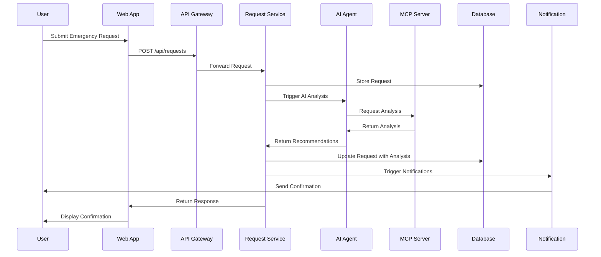
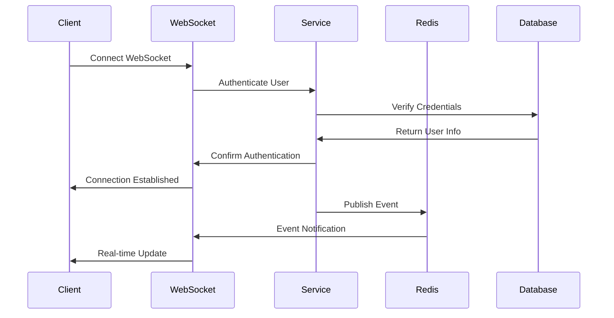
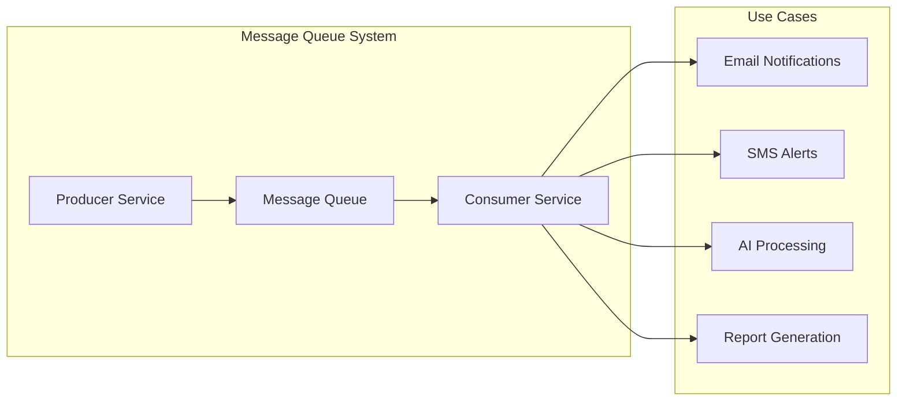
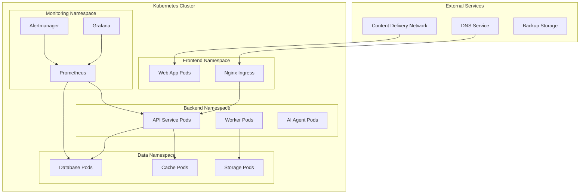
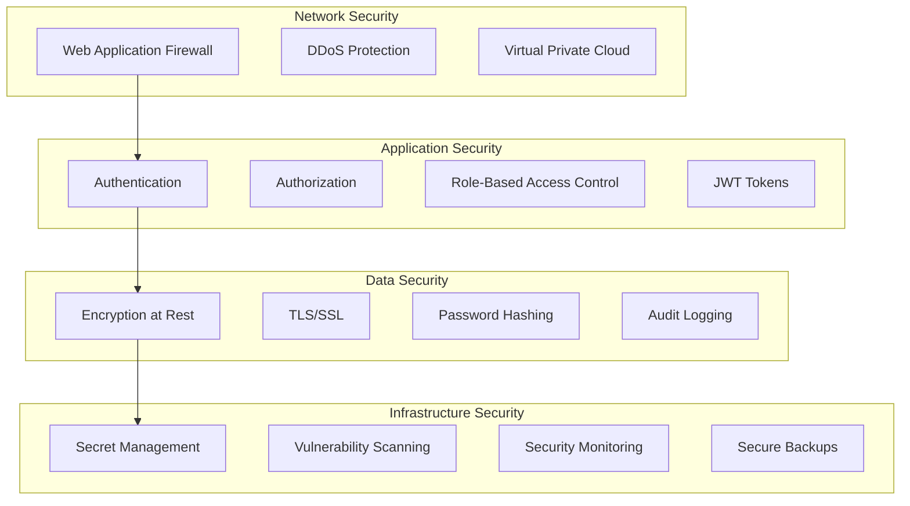
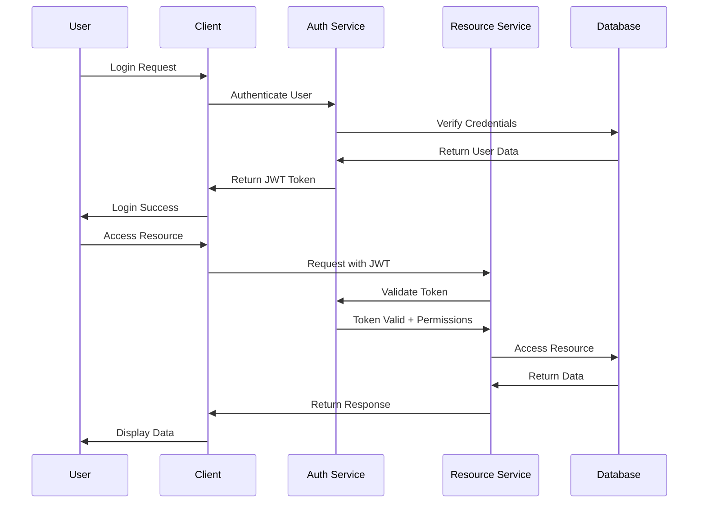
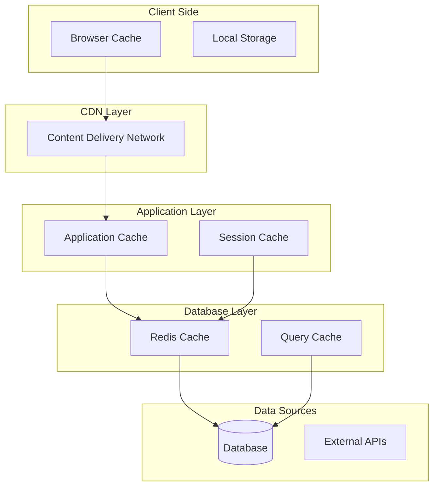
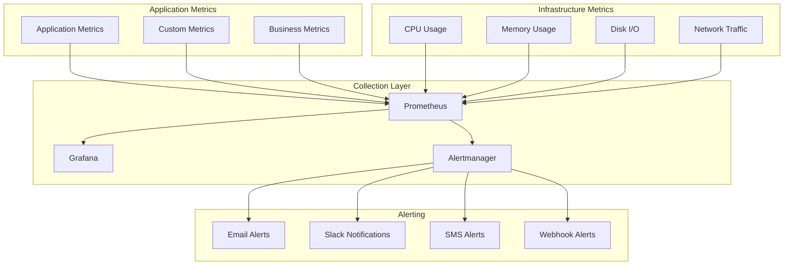

# System Architecture Overview

This document provides a comprehensive overview of the disaster response coordination system architecture, including system components, data flow, integration patterns, and design principles.

## System Architecture

### High-Level Architecture

```mermaid
graph TB
    subgraph "Frontend Layer"
        WEB[Web Application]
        MOBILE[Mobile App]
        PWA[Progressive Web App]
    end

    subgraph "API Gateway"
        GATEWAY[API Gateway]
        AUTH[Authentication Service]
        RATE[Rate Limiting]
    end

    subgraph "Backend Services"
        USER[User Service]
        REQ[Request Service]
        TASK[Task Service]
        RES[Resource Service]
        NOTIF[Notification Service]
        AI[AI Agent Service]
    end

    subgraph "AI & ML Layer"
        MCP[MCP Server]
        ML[ML Models]
        AGENTS[AI Agents]
        PREDICT[Prediction Engine]
    end

    subgraph "Data Layer"
        POSTGRES[(PostgreSQL)]
        REDIS[(Redis Cache)]
        S3[(File Storage)]
        SEARCH[(Search Engine)]
    end

    subgraph "External Services"
        SMS[SMS Gateway]
        EMAIL[Email Service]
        WEATHER[Weather API]
        MAPS[Mapping Service]
        EMERGENCY[Emergency Services]
    end

    subgraph "Infrastructure"
        LB[Load Balancer]
        MONITOR[Monitoring]
        LOGS[Logging]
        BACKUP[Backup Service]
    end

    WEB --> GATEWAY
    MOBILE --> GATEWAY
    PWA --> GATEWAY

    GATEWAY --> AUTH
    GATEWAY --> RATE
    GATEWAY --> USER
    GATEWAY --> REQ
    GATEWAY --> TASK
    GATEWAY --> RES
    GATEWAY --> NOTIF
    GATEWAY --> AI

    AI --> MCP
    AI --> ML
    AI --> AGENTS
    AI --> PREDICT

    USER --> POSTGRES
    REQ --> POSTGRES
    TASK --> POSTGRES
    RES --> POSTGRES

    USER --> REDIS
    REQ --> REDIS
    TASK --> REDIS
    RES --> REDIS

    NOTIF --> SMS
    NOTIF --> EMAIL

    AI --> WEATHER
    AI --> MAPS

    REQ --> EMERGENCY

    LB --> GATEWAY
    MONITOR --> USER
    MONITOR --> REQ
    MONITOR --> TASK
    MONITOR --> RES

    LOGS --> USER
    LOGS --> REQ
    LOGS --> TASK
    LOGS --> RES
```

### System Components

#### Frontend Layer

- **Web Application**: React-based responsive web interface
- **Mobile App**: React Native cross-platform mobile application
- **Progressive Web App**: PWA capabilities for offline functionality

#### API Gateway Layer

- **API Gateway**: Central entry point for all API requests
- **Authentication Service**: JWT-based authentication and authorization
- **Rate Limiting**: Request rate limiting and throttling

#### Backend Services

- **User Service**: User management, profiles, and authentication
- **Request Service**: Emergency request processing and management
- **Task Service**: Task creation, assignment, and tracking
- **Resource Service**: Resource allocation and management
- **Notification Service**: Multi-channel notification delivery
- **AI Agent Service**: AI agent coordination and management

#### AI & ML Layer

- **MCP Server**: Model Context Protocol server for AI integration
- **ML Models**: Machine learning models for prediction and analysis
- **AI Agents**: Specialized AI agents for different tasks
- **Prediction Engine**: Predictive analytics and forecasting

#### Data Layer

- **PostgreSQL**: Primary relational database
- **Redis Cache**: In-memory caching and session storage
- **File Storage**: S3-compatible object storage for files
- **Search Engine**: Elasticsearch for advanced search capabilities

## Design Principles

### Scalability

- **Horizontal Scaling**: Services designed for horizontal scaling
- **Microservices Architecture**: Loosely coupled, independently deployable services
- **Load Distribution**: Traffic distribution across multiple instances
- **Database Sharding**: Database partitioning for performance

### Reliability

- **High Availability**: 99.9% uptime target with redundancy
- **Fault Tolerance**: Graceful degradation and error handling
- **Data Consistency**: ACID transactions and eventual consistency
- **Backup and Recovery**: Automated backup and disaster recovery

### Security

- **Zero Trust Architecture**: Verify every request and user
- **End-to-End Encryption**: Data encryption in transit and at rest
- **Role-Based Access Control**: Fine-grained permission system
- **Audit Logging**: Comprehensive audit trails

### Performance

- **Sub-second Response**: Target response times under 1 second
- **Caching Strategy**: Multi-layer caching for performance
- **CDN Integration**: Content delivery network for static assets
- **Database Optimization**: Query optimization and indexing

## Data Flow Architecture

### Emergency Request Processing Flow

### Real-time Communication Flow

## Integration Patterns

### API Integration

- **RESTful APIs**: Standard REST endpoints for CRUD operations
- **GraphQL**: Flexible query language for complex data fetching
- **WebSocket**: Real-time bidirectional communication
- **Webhooks**: Event-driven external service integration

### Message Queue Integration

### External Service Integration

- **Weather Services**: Real-time weather data integration
- **Mapping Services**: Geographic data and routing
- **Emergency Services**: Integration with 911/119 systems
- **Government Systems**: Inter-agency data sharing

## Deployment Architecture

### Containerized Deployment

### Multi-Environment Strategy

- **Development**: Local development environment
- **Staging**: Pre-production testing environment
- **Production**: Live production environment
- **Disaster Recovery**: Backup production environment

## Security Architecture

### Security Layers

### Authentication and Authorization Flow

## Performance Architecture

### Caching Strategy

### Load Balancing Strategy

- **Round Robin**: Equal distribution of requests
- **Least Connections**: Route to least busy server
- **Geographic**: Route based on user location
- **Health Checks**: Automatic failover for unhealthy servers

## Monitoring and Observability

### Monitoring Stack

### Logging Strategy

- **Structured Logging**: JSON-formatted logs with metadata
- **Centralized Logging**: All logs aggregated in central system
- **Log Levels**: Debug, Info, Warning, Error, Critical
- **Log Retention**: Configurable retention policies

## Disaster Recovery

### Backup Strategy

- **Database Backups**: Daily automated database backups
- **File Backups**: Regular backup of uploaded files
- **Configuration Backups**: System configuration backups
- **Cross-Region Replication**: Geographic backup distribution

### Recovery Procedures

1. **Assessment**: Determine scope and impact of disaster
2. **Activation**: Activate disaster recovery procedures
3. **Recovery**: Restore systems from backups
4. **Validation**: Verify system functionality
5. **Communication**: Update stakeholders on status

## Technology Stack

### Frontend Technologies

- **React**: User interface framework
- **TypeScript**: Type-safe JavaScript
- **Material-UI**: Component library
- **Redux**: State management
- **React Query**: Server state management

### Backend Technologies

- **Node.js**: Runtime environment
- **Express.js**: Web framework
- **TypeScript**: Type-safe JavaScript
- **Prisma**: Database ORM
- **Socket.io**: WebSocket implementation

### Database Technologies

- **PostgreSQL**: Primary database
- **Redis**: Caching and sessions
- **Elasticsearch**: Search and analytics
- **MinIO**: Object storage

### AI/ML Technologies

- **Python**: AI/ML development
- **FastAPI**: AI service framework
- **OpenAI API**: Language model integration
- **scikit-learn**: Machine learning library
- **TensorFlow**: Deep learning framework

### Infrastructure Technologies

- **Docker**: Containerization
- **Kubernetes**: Container orchestration
- **Helm**: Kubernetes package manager
- **Terraform**: Infrastructure as code
- **GitHub Actions**: CI/CD pipeline

## Scalability Considerations

### Horizontal Scaling

- **Service Replication**: Multiple instances of each service
- **Database Sharding**: Horizontal database partitioning
- **Load Distribution**: Request distribution across instances
- **Auto-scaling**: Automatic scaling based on demand

### Vertical Scaling

- **Resource Optimization**: CPU and memory optimization
- **Database Tuning**: Query and index optimization
- **Cache Optimization**: Efficient caching strategies
- **Connection Pooling**: Database connection optimization

## Future Architecture Considerations

### Emerging Technologies

- **Edge Computing**: Processing closer to data sources
- **5G Integration**: Enhanced mobile connectivity
- **IoT Integration**: Internet of Things device integration
- **Blockchain**: Secure and transparent record keeping

### Architecture Evolution

- **Serverless Computing**: Function-as-a-Service adoption
- **Event-Driven Architecture**: Enhanced event-driven patterns
- **Multi-Cloud Strategy**: Cloud provider diversification
- **API-First Design**: API-centric architecture approach
