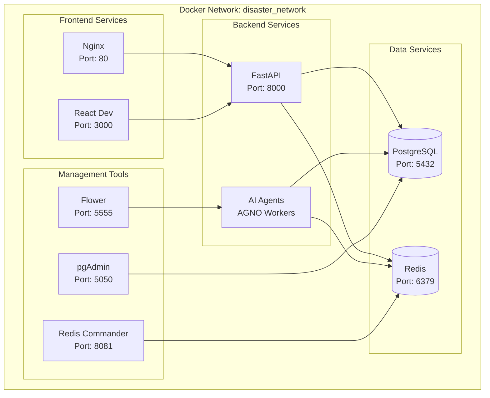

# Docker Setup Guide

Complete guide for running the Disaster Response Coordination System with Docker.

## 🐳 Prerequisites

Ensure you have the following installed:

- **Docker**: Version 20.10 or higher
- **Docker Compose**: Version 2.0 or higher
- **Make**: For convenience commands (optional)

### Installation Links

- [Docker Desktop](https://www.docker.com/products/docker-desktop/) (Windows/Mac)
- [Docker Engine](https://docs.docker.com/engine/install/) (Linux)

## 📁 Docker Architecture



## 🚀 Quick Start

### 1. Environment Setup

```bash
# Clone repository
git clone <repository-url>
cd IntelliHack-2025-Final-Round-Challenge

# Create environment file
cp ai_services/.env.example ai_services/.env
```

Edit `ai_services/.env` with your OpenAI API key:

```env
OPENAI_API_KEY=your-openai-api-key-here
```

### 2. Start All Services

```bash
# Using Make (recommended)
make docker-up

# Or directly with Docker Compose
docker-compose up -d
```

### 3. Initialize Database

```bash
# Run migrations and seed data
make db-setup

# Or manually
docker-compose exec api python database/init_db.py
```

## 🛠️ Docker Services

### Core Application Services

| Service | Description | Port | Health Check |
|---------|-------------|------|--------------|
| `frontend` | React development server | 3000 | http://localhost:3000 |
| `api` | FastAPI backend | 8000 | http://localhost:8000/health |
| `ai_services` | AGNO AI agents | - | Internal |
| `nginx` | Reverse proxy | 80 | http://localhost |

### Data Services

| Service | Description | Port | Credentials |
|---------|-------------|------|-------------|
| `postgres` | PostgreSQL database | 5432 | postgres/password |
| `redis` | Redis cache & sessions | 6379 | No password |

### Management Tools

| Service | Description | Port | Access |
|---------|-------------|------|--------|
| `pgadmin` | Database management | 5050 | admin@admin.com/admin |
| `redis-commander` | Redis management | 8081 | No auth |
| `flower` | Task monitoring | 5555 | No auth |

## 📋 Docker Commands

### Service Management

```bash
# Start all services
make docker-up
# or
docker-compose up -d

# Stop all services
make docker-down
# or
docker-compose down

# Restart services
make docker-restart
# or
docker-compose restart

# View logs
make docker-logs
# or
docker-compose logs -f

# Check service status
docker-compose ps
```

### Development Commands

```bash
# Start in development mode (with file watching)
make docker-dev

# Rebuild services after code changes
make docker-build
# or
docker-compose build

# Start specific service
docker-compose up -d postgres redis
docker-compose up frontend

# Execute commands in containers
docker-compose exec api bash
docker-compose exec postgres psql -U postgres disaster_response
```

### Database Operations

```bash
# Initialize database
make db-setup

# Reset database (destructive!)
make db-reset

# Backup database
make db-backup

# Restore database
make db-restore backup.sql

# Run migrations only
docker-compose exec api alembic upgrade head
```

### Troubleshooting Commands

```bash
# View detailed logs for specific service
docker-compose logs -f api
docker-compose logs -f postgres

# Check container health
docker-compose exec api curl http://localhost:8000/health

# Inspect network
docker network inspect intellihack-2025-final-round-challenge_disaster_network

# Clean up (remove containers, networks, volumes)
make docker-clean
# or
docker-compose down -v --remove-orphans
docker system prune -f
```

## 🔧 Configuration

### Docker Compose Override

Create `docker-compose.override.yml` for local customizations:

```yaml
version: '3.8'

services:
  api:
    ports:
      - "8000:8000"
    environment:
      DEBUG: "true"
      LOG_LEVEL: "DEBUG"
    volumes:
      - ./ai_services:/app:cached
      
  frontend:
    ports:
      - "3000:3000"
    volumes:
      - ./frontend:/app:cached
      - /app/node_modules
    environment:
      FAST_REFRESH: "true"
```

### Environment Variables

Docker services use these environment files:

- `ai_services/.env` - Backend configuration
- `.env` - Docker Compose variables (optional)

Key Docker-specific variables:

```env
# Docker Compose settings
COMPOSE_PROJECT_NAME=disaster-response
COMPOSE_FILE=docker-compose.yml:docker-compose.override.yml

# Database
POSTGRES_DB=disaster_response
POSTGRES_USER=postgres
POSTGRES_PASSWORD=password

# Redis
REDIS_PASSWORD=

# Network
DISASTER_NETWORK_SUBNET=172.20.0.0/16
```

### Volume Mounts

The system uses these volumes:

```yaml
volumes:
  postgres_data:          # Database persistence
  redis_data:             # Redis persistence
  node_modules:           # Frontend dependencies
  ai_services_cache:      # Python cache
```

## 🌐 Network Configuration

### Port Mapping

Default port mapping:

- **80** → Nginx (production entry point)
- **3000** → React development server
- **8000** → FastAPI backend
- **5432** → PostgreSQL database
- **6379** → Redis
- **5050** → pgAdmin
- **8081** → Redis Commander
- **5555** → Flower task monitor

### Custom Ports

To avoid conflicts, modify `docker-compose.yml`:

```yaml
services:
  frontend:
    ports:
      - "3001:3000"  # Use port 3001 instead
      
  api:
    ports:
      - "8001:8000"  # Use port 8001 instead
```

## 🏗️ Development Workflow

### Code Changes

1. **Frontend changes**: Auto-reload via React dev server
2. **Backend changes**: Auto-reload via uvicorn
3. **Database changes**: Restart required

```bash
# Apply database migrations
make db-migrate

# Restart backend after schema changes
docker-compose restart api ai_services
```

### Debugging

```bash
# Enter container for debugging
docker-compose exec api bash
docker-compose exec frontend sh

# View real-time logs
docker-compose logs -f api frontend

# Debug database
docker-compose exec postgres psql -U postgres disaster_response
```

### Testing in Docker

```bash
# Run backend tests
docker-compose exec api pytest

# Run frontend tests
docker-compose exec frontend npm test

# Run tests with coverage
docker-compose exec api pytest --cov=./ --cov-report=html
```

## 🚀 Production Deployment

### Production Docker Compose

Create `docker-compose.prod.yml`:

```yaml
version: '3.8'

services:
  frontend:
    build:
      context: ./frontend
      dockerfile: Dockerfile
    environment:
      NODE_ENV: production
      
  api:
    build:
      context: ./ai_services
      dockerfile: Dockerfile
    environment:
      ENVIRONMENT: production
      DEBUG: "false"
      
  nginx:
    image: nginx:alpine
    ports:
      - "80:80"
      - "443:443"
    volumes:
      - ./nginx/prod.conf:/etc/nginx/nginx.conf
      - ./ssl:/etc/nginx/ssl
```

### SSL Configuration

```bash
# Generate SSL certificates
mkdir ssl
openssl req -x509 -nodes -days 365 -newkey rsa:2048 \
    -keyout ssl/private.key \
    -out ssl/certificate.crt
```

## 🔍 Health Checks

All services include health checks:

```bash
# Check all service health
docker-compose ps

# Manual health checks
curl http://localhost:8000/health
curl http://localhost:3000
curl http://localhost/health
```

Health check endpoints:

- **API**: `/health` - Returns system status
- **Frontend**: `/` - React app loads
- **Database**: Connection test
- **Redis**: Ping command

## 📚 Next Steps

- [Environment Configuration](environment.md) - Configure variables
- [Quick Setup](quick-setup.md) - Alternative setup methods
- [Troubleshooting](../troubleshooting.md) - Common Docker issues

---

Need help with Docker? Check our [Troubleshooting Guide](../troubleshooting.md#docker-issues) for common solutions.
