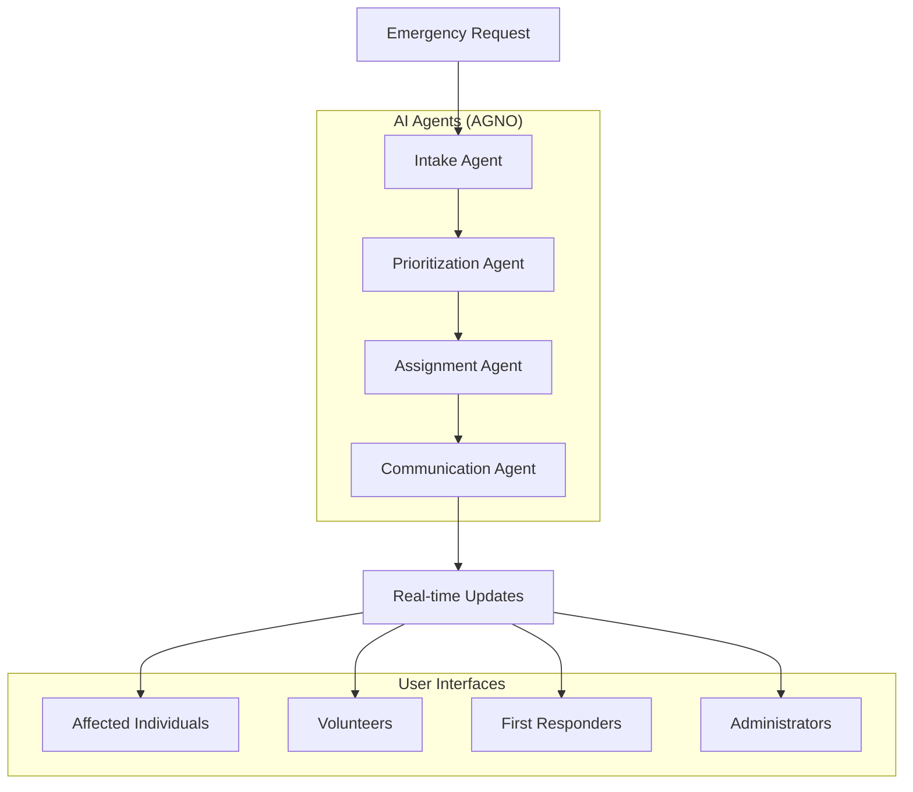

# Disaster Response Coordination System

An AI-powered disaster response coordination system featuring multi-agent workflow, real-time communication, and role-based dashboards for emergency response teams.

## 🚨 Emergency Response Features

- **AI-Powered Processing**: Automated request analysis and prioritization through AGNO agents
- **Real-time Coordination**: WebSocket-based live updates and notifications
- **Multi-Role Support**: Dashboards for Affected Individuals, Volunteers, First Responders, and Administrators
- **Resource Management**: Track and allocate emergency supplies and personnel
- **Task Assignment**: Intelligent distribution of emergency response tasks
- **MCP Integration**: Model Context Protocol support for LLM applications

## 🏗️ System Architecture

## 🎯 Quick Navigation

-   :material-rocket-launch:{ .lg .middle } **Getting Started**

    ---

    Set up the system quickly with Docker and start coordinating disaster response

    [:octicons-arrow-right-24: Quick Setup](getting-started/quick-setup.md)

-   :material-brain:{ .lg .middle } **AI Agents**

    ---

    Learn about the AGNO agent workflow for intelligent request processing

    [:octicons-arrow-right-24: AI Architecture](architecture/ai-agents.md)

-   :material-account-group:{ .lg .middle } **User Guides**

    ---

    Role-specific guides for all system users

    [:octicons-arrow-right-24: User Guides](user-guides/affected-individuals.md)

-   :material-api:{ .lg .middle } **API Reference**

    ---

    Complete API documentation for developers

    [:octicons-arrow-right-24: API Docs](api/authentication.md)

## 🌟 Key Features

### Multi-Agent AI Processing

The system uses four specialized AI agents powered by OpenAI GPT-4o-mini:

1. **Intake Agent** - Processes and validates incoming emergency requests
2. **Prioritization Agent** - Assesses and prioritizes requests based on severity
3. **Assignment Agent** - Matches requests with appropriate responders and resources
4. **Communication Agent** - Handles notifications and status updates

### Real-time Collaboration

- WebSocket-based live updates
- Role-based dashboards with real-time data
- Instant notifications for task assignments and status changes
- Live resource availability tracking

### Comprehensive Resource Management

- Emergency supply inventory tracking
- Personnel availability and skill matching
- Equipment allocation and monitoring
- Automated resource consumption tracking

## 🚀 Getting Started

1. **[Quick Setup](getting-started/quick-setup.md)** - Get the system running in minutes
2. **[Environment Configuration](getting-started/environment.md)** - Configure your environment variables
3. **[User Guides](user-guides/affected-individuals.md)** - Learn how to use the system

## 📋 System Requirements

- Docker and Docker Compose
- Node.js 18+ (for development)
- Python 3.9+ (for development)
- OpenAI API key (for AI agents)
- Supabase account (for database)

## 🛠️ Technology Stack

- **Frontend**: React 19, TypeScript, Tailwind CSS
- **Backend**: FastAPI, Python, PostgreSQL
- **AI**: AGNO framework, OpenAI GPT-4o-mini
- **Real-time**: WebSockets, Redis
- **Infrastructure**: Docker, Nginx

## 📞 Support

For technical support or questions:

- Check the [Troubleshooting Guide](troubleshooting.md)
- Review the [API Documentation](api/authentication.md)
- Submit issues via the project repository

---

*Built for IntelliHack 2025 Final Round Challenge*
