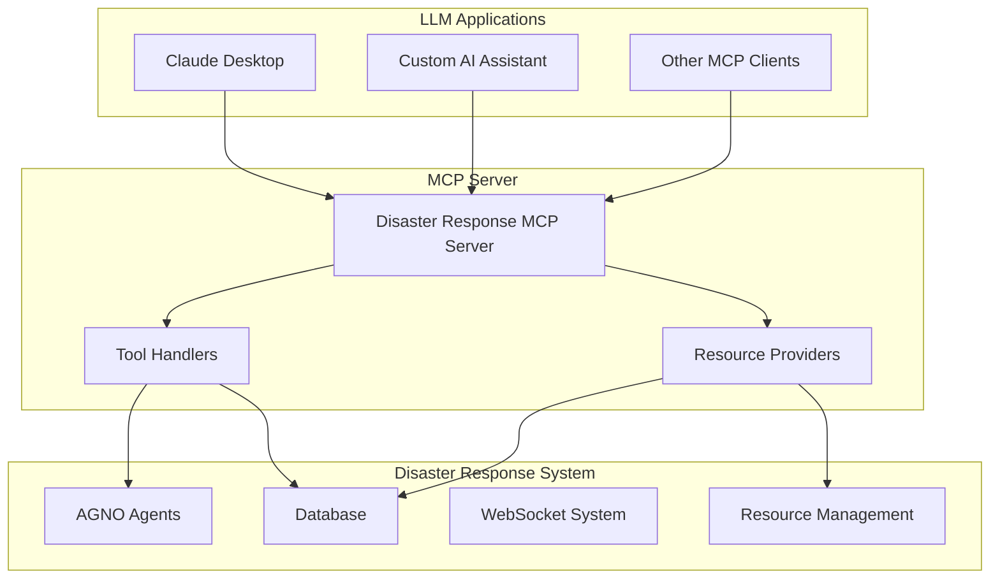
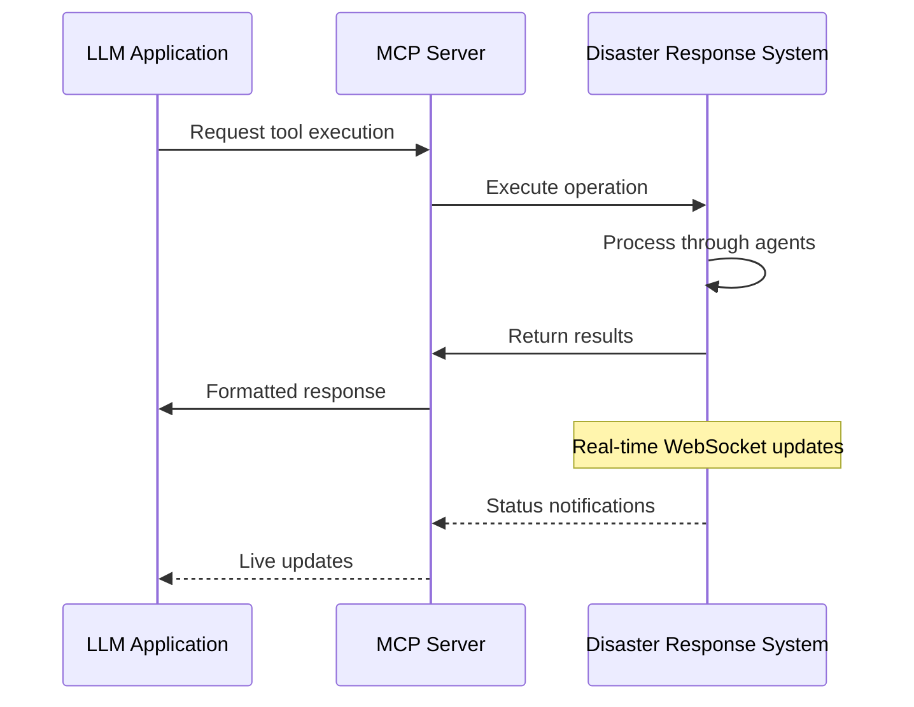

# MCP Integration Overview

The Disaster Response Coordination System supports the Model Context Protocol (MCP), enabling seamless integration with Large Language Model applications and AI assistants.

## 🔗 What is MCP?

Model Context Protocol (MCP) is a universal standard for connecting AI assistants to external tools and data sources. Our MCP server exposes disaster response capabilities as standardized tools that can be used by any MCP-compatible LLM application.

## 🏗️ Architecture



## 🛠️ Available Tools

The MCP server exposes these disaster response tools:

### Emergency Request Processing

**Tool**: `process_emergency_request`

Process an emergency help request through the complete AGNO agent pipeline.

```json
{
  "name": "process_emergency_request",
  "description": "Process an emergency help request through the AGNO agent pipeline",
  "inputSchema": {
    "type": "object",
    "properties": {
      "title": {
        "type": "string",
        "description": "Brief title of the emergency request"
      },
      "description": {
        "type": "string",
        "description": "Detailed description of the emergency situation"
      },
      "location": {
        "type": "string",
        "description": "Location of the emergency (optional)"
      },
      "contact_info": {
        "type": "string",
        "description": "Contact information for the requester (optional)"
      }
    },
    "required": ["title", "description"]
  }
}
```

**Example Usage**:

```
Human: Process this emergency: "Building collapse at 123 Main Street, people trapped"

AI Response: I'll process this emergency request through the disaster response system.

{
  "success": true,
  "request_id": "req_20240115_103045_001",
  "message": "Emergency request processed successfully",
  "processing_result": {
    "intake": {
      "needs": ["rescue", "medical"],
      "priority": "critical",
      "extracted_location": "123 Main Street"
    },
    "assignment": {
      "assigned_teams": ["rescue_team_1", "medical_team_2"],
      "estimated_response_time": "8 minutes"
    }
  }
}
```

### System Status Monitoring

**Tool**: `get_agent_status`

Get current status of the disaster response AI agent system.

```json
{
  "name": "get_agent_status",
  "description": "Get current status of the disaster response AI agent system",
  "inputSchema": {
    "type": "object",
    "properties": {}
  }
}
```

### Active Request Management

**Tool**: `get_active_requests`

Retrieve active disaster response requests with filtering options.

```json
{
  "name": "get_active_requests",
  "description": "Retrieve active disaster response requests with their status",
  "inputSchema": {
    "type": "object",
    "properties": {
      "status": {
        "type": "string",
        "enum": [
          "PENDING",
          "PROCESSING",
          "ASSIGNED",
          "IN_PROGRESS",
          "COMPLETED"
        ],
        "description": "Filter requests by status (optional)"
      },
      "priority": {
        "type": "string",
        "enum": ["CRITICAL", "HIGH", "MEDIUM", "LOW"],
        "description": "Filter requests by priority (optional)"
      },
      "limit": {
        "type": "integer",
        "description": "Maximum number of requests to return (default: 10)"
      }
    }
  }
}
```

## 📊 Available Resources

The MCP server provides access to real-time disaster response data:

### Active Emergency Requests

**Resource**: `disaster://requests/active`

Real-time access to all active emergency requests in the system.

### Agent System Status

**Resource**: `disaster://agents/status`

Current status and metrics of the AI agent system.

### Resource Inventory

**Resource**: `disaster://resources/inventory`

Current inventory of disaster response resources (supplies, equipment, personnel).

### Available Volunteers

**Resource**: `disaster://volunteers/available`

List of available volunteers and their skills/locations.

## 🔄 Real-time Integration

The MCP server provides real-time access to the disaster response system:



## 🎯 Use Cases

### Emergency Response Coordination

```
Human: "What active emergencies need immediate attention?"

AI: Let me check the current emergency status.

[Calls get_active_requests with priority="CRITICAL"]

Currently there are 3 critical emergencies requiring immediate attention:
1. Building collapse at 123 Main St - Rescue team dispatched, ETA 5 minutes
2. Medical emergency at City Park - Ambulance en route
3. Gas leak at Oak Avenue - Hazmat team responding
```

### Resource Management

```
Human: "Do we have enough medical supplies for a mass casualty event?"

AI: I'll check the current resource inventory.

[Calls disaster://resources/inventory]

Current medical supply status:
- First aid kits: 45 available (above minimum threshold)
- Emergency medications: 23 units (low stock alert)
- Stretchers: 12 available
- Medical oxygen: 8 tanks (adequate for current operations)

Recommendation: Restock emergency medications before next deployment.
```

### Volunteer Coordination

```
Human: "I need to assign volunteers with medical training to a new emergency"

AI: Let me find available volunteers with medical skills.

[Calls disaster://volunteers/available with medical skill filter]

Found 7 volunteers with medical training currently available:
- Dr. Sarah Johnson (Emergency Medicine) - Downtown area
- Nurse Mike Chen (ICU) - North district
- EMT Lisa Rodriguez (Paramedic) - Central area
...

Would you like me to assign specific volunteers to the emergency?
```

## 🚀 Benefits

### For LLM Applications

- **Direct Emergency Response**: Submit and track emergency requests
- **Real-time Monitoring**: Access live system status and updates
- **Resource Awareness**: Check availability before making assignments
- **Workflow Integration**: Incorporate disaster response into broader AI workflows

### For Emergency Managers

- **AI-Assisted Coordination**: Use AI assistants to manage complex response scenarios
- **Natural Language Interface**: Query system status using plain English
- **Automated Reporting**: Generate status reports and summaries
- **Decision Support**: Get AI-powered recommendations for resource allocation

### For Developers

- **Standardized Integration**: Use MCP instead of custom API integrations
- **Tool Composition**: Combine disaster response tools with other MCP tools
- **Event-Driven Updates**: Receive real-time notifications through MCP
- **Easy Testing**: Use any MCP client to test and validate integrations

## 🔧 Technical Implementation

The MCP server is implemented using the official MCP Python SDK:

```python
from mcp.server import Server
from mcp.server.stdio import stdio_server

class DisasterResponseMCPServer:
    def __init__(self):
        self.server = Server("disaster-response-mcp")
        self.agent_coordinator = AgentCoordinator()
        self._setup_tools()
        self._setup_resources()
```

Key features:

- **Async Support**: All operations are asynchronous for better performance
- **Error Handling**: Comprehensive error handling with informative messages
- **Type Safety**: Full type annotations and schema validation
- **Logging**: Detailed logging for debugging and monitoring

## 📈 Performance Considerations

### Caching

- Resource data is cached for 30 seconds to reduce database load
- Agent status is cached for 10 seconds for real-time responsiveness
- Request data is never cached to ensure accuracy

### Rate Limiting

- Maximum 100 requests per minute per client
- Bulk operations limited to 50 items per request
- Long-running operations use background processing

### Scalability

- MCP server can handle multiple concurrent clients
- Database queries are optimized with proper indexing
- WebSocket connections are managed efficiently

---

Next: [Available Tools](tools.md) | [Setup Guide](setup.md)
