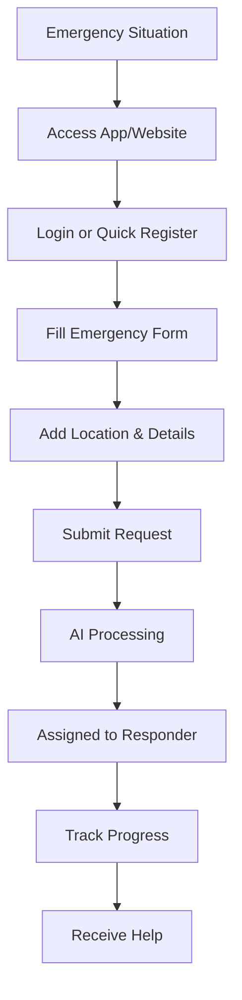
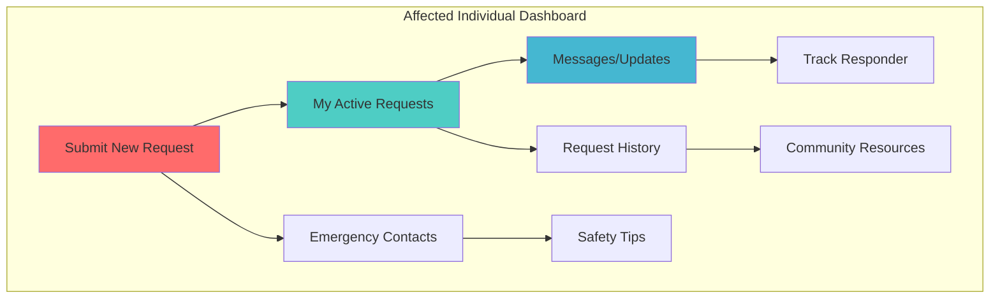

# Affected Individuals Guide

Complete guide for people seeking help during disasters and emergencies.

## 👋 Getting Started

As an affected individual, you can use this system to:

- **Request immediate help** during emergencies
- **Track your request status** in real-time
- **Communicate with responders** directly
- **Receive updates** on response progress
- **Access community resources** and support

## 🚨 Submitting Emergency Requests

### Quick Request Flow

### Step-by-Step Instructions

1. **Access the System**

   - Website: [http://localhost:3000](http://localhost:3000)
   - Mobile app (if available)
   - Emergency hotline integration

2. **Quick Registration**

   - Email and phone number
   - Basic location information
   - Emergency contact details

3. **Emergency Request Form**

   

   **Required Information:**

   - **Emergency Type**: Medical, Fire, Rescue, Shelter, Supplies
   - **Description**: Clear, detailed explanation
   - **Location**: Exact address or GPS coordinates
   - **Urgency Level**: 1 (low) to 10 (critical)
   - **People Affected**: Number of individuals needing help
   - **Contact Information**: Phone, preferred contact method

   **Optional but Helpful:**

   - Photos of the situation
   - Voice recordings
   - Special needs (medical conditions, disabilities)
   - Available resources at location

### Emergency Types Guide

=== "🏥 Medical Emergency"

    **When to use**: Injuries, illness, medical crisis

    **Information to include**:
    - Nature of medical issue
    - Patient's condition
    - Symptoms observed
    - Any medications or allergies
    - Access to the patient

    **Example**: "Elderly neighbor fell down stairs. Conscious but can't move. Possible broken leg. She's diabetic and takes insulin."

=== "🔥 Fire Emergency"

    **When to use**: Structure fires, wildfires, gas leaks

    **Information to include**:
    - Type and size of fire
    - People trapped or evacuated
    - Nearby structures at risk
    - Fire department contacted?

    **Example**: "Kitchen fire spreading to living room. Family evacuated safely. 2-story house, neighbors' homes 20 feet away."

=== "⛑️ Rescue Operation"

    **When to use**: People trapped, missing persons, vehicle accidents

    **Information to include**:
    - Number of people involved
    - Type of entrapment
    - Hazards present
    - Equipment needed

    **Example**: "Car accident on Highway 101. Driver trapped in vehicle. Conscious but injured. Heavy traffic area."

=== "🏠 Shelter Needed"

    **When to use**: Displacement due to disaster, homelessness

    **Information to include**:
    - Number of people needing shelter
    - Special needs (children, elderly, pets)
    - Duration of need
    - Current temporary location

    **Example**: "Family of 4 displaced by flooding. Need temporary shelter for 3-5 days. Have elderly grandmother requiring medication."

=== "📦 Supplies Request"

    **When to use**: Food, water, medicine, clothing needs

    **Information to include**:
    - Specific items needed
    - Quantities required
    - Urgent vs. non-urgent items
    - Delivery accessibility

    **Example**: "Isolated by landslide. Need food and water for 6 people for 3 days. Baby formula urgently needed."

## 📱 Dashboard Overview

### Your Dashboard Features

### Active Request Status

Track your request through these stages:

| Status             | Description       | What to Expect                        |
| ------------------ | ----------------- | ------------------------------------- |
| 🔍 **Submitted**   | Request received  | AI analysis in progress (2-5 minutes) |
| ⚡ **Processing**  | AI categorizing   | Priority assignment and matching      |
| 📋 **Prioritized** | Urgency assessed  | Looking for available responders      |
| 👤 **Assigned**    | Responder matched | Responder notified, ETA provided      |
| 🚀 **En Route**    | Help coming       | Responder traveling to location       |
| 🎯 **In Progress** | Help arrived      | Assistance being provided             |
| ✅ **Completed**   | Help provided     | Request resolved                      |

### Real-Time Updates

You'll receive updates via:

- **In-app notifications**
- **SMS messages** to your phone
- **Email updates**
- **Push notifications** (mobile app)

Example update: _"Emergency responder Jane Smith has been assigned to your medical emergency request. ETA: 8 minutes. Contact: +1-555-0123"_

## 💬 Communication with Responders

### Messaging System

**Send Updates**:

- Changes in situation
- Additional information
- Answer responder questions
- Share photos/videos

**Receive Information**:

- Responder ETA
- What to prepare
- Safety instructions
- Next steps

### Quick Communication Templates

Use pre-written messages for common updates:

- "Situation has worsened - please hurry"
- "Patient condition stable"
- "We've evacuated to safe location"
- "Additional people need help"
- "Situation resolved - help no longer needed"

### Emergency Contact Protocol

1. **Primary Contact**: Your phone number (SMS/call)
2. **Secondary Contact**: Alternative person who can speak for you
3. **Emergency Services**: System can coordinate with 911 if needed
4. **Family Notification**: Automated updates to family members

## 🗺️ Location and Safety

### Providing Accurate Location

**Best Practices**:

- Use GPS coordinates when possible
- Include landmarks and cross streets
- Specify apartment/unit numbers
- Note access difficulties (locked gates, construction)
- Mark safe meeting points

**Location Sharing**:

- Allow real-time location tracking
- Update if you move to safety
- Share alternative access routes

### Safety While Waiting

**Do**:

- Stay in safe location if possible
- Keep phone charged and accessible
- Follow responder instructions
- Prepare identification documents
- Gather essential medications/items

**Don't**:

- Leave designated location without updating
- Ignore safety instructions
- Block access routes
- Use electrical equipment near gas leaks
- Enter damaged structures

## 📞 Emergency Contacts and Resources

### Important Contacts

Keep these numbers readily available:

| Contact              | Number           | When to Use                 |
| -------------------- | ---------------- | --------------------------- |
| Emergency Services   | 911              | Life-threatening situations |
| Poison Control       | 1-800-222-1222   | Poisoning emergencies       |
| Mental Health Crisis | 988              | Mental health emergencies   |
| Red Cross            | 1-800-733-2767   | Disaster assistance         |
| System Support       | [Support Number] | App/platform issues         |

### Community Resources

Access information about:

- **Emergency Shelters**: Locations and capacity
- **Food Banks**: Distribution sites and times
- **Medical Facilities**: Hospitals, clinics, pharmacies
- **Transportation**: Emergency transport options
- **Utilities**: Outage reports and restoration
- **Government Services**: FEMA, local emergency management

### Mental Health Support

Disasters can be traumatic. Available support:

- **Crisis counseling**: Immediate emotional support
- **Support groups**: Connect with others affected
- **Resource referrals**: Long-term mental health services
- **Family services**: Help for children and families

## 📋 Request History and Follow-up

### Tracking Past Requests

View your complete request history:

- **Date and time** of each request
- **Response times** and outcomes
- **Responders involved** and their feedback
- **Resources provided** and usage
- **Follow-up actions** needed

### Providing Feedback

Help improve the system by rating:

- **Response time**: How quickly help arrived
- **Communication**: Quality of updates and contact
- **Effectiveness**: How well your needs were met
- **Professionalism**: Responder conduct and competence
- **Overall experience**: General satisfaction

### Follow-up Care

Some situations require ongoing support:

- **Medical follow-up**: Check on recovery progress
- **Resource needs**: Continued assistance requirements
- **Documentation**: Insurance claims, official reports
- **Community rebuilding**: Long-term recovery efforts

## 🛡️ Privacy and Data Protection

### Your Data Rights

- **Control**: You decide what information to share
- **Privacy**: Personal data protected and encrypted
- **Access**: View all data the system has about you
- **Deletion**: Request removal of your information
- **Portability**: Export your data if needed

### What We Share

**With Responders**:

- Contact information
- Location data
- Emergency details
- Medical information (if provided)

**With Authorities** (only when legally required):

- Basic incident information
- Location for coordination
- Safety-critical details

**Never Shared**:

- Unrelated personal information
- Financial details
- Private communications
- Historical requests (unless relevant)

## 🎓 Tips for Effective Help Requests

### Writing Clear Descriptions

**Good Example**:

> "Medical emergency: 65-year-old male fell from ladder while cleaning gutters. Unconscious for 2 minutes, now conscious but severe pain in left leg. Possible fracture. Patient is diabetic, takes metformin. Located in backyard, accessible through side gate. Family member with first aid training on scene."

**Poor Example**:

> "Someone fell, please help"

### Urgency Level Guidelines

- **10 (Critical)**: Life-threatening, immediate danger
- **8-9 (High)**: Serious injury/situation, urgent response needed
- **6-7 (Medium)**: Important but not immediately life-threatening
- **4-5 (Low-Medium)**: Assistance needed but not urgent
- **1-3 (Low)**: Non-urgent support or information request

### Photo/Video Best Practices

**Do Include**:

- Wide shots showing overall situation
- Close-ups of specific issues
- Multiple angles when helpful
- Faces (with permission) for missing persons

**Don't Include**:

- Graphic injuries (unless specifically needed)
- Unrelated personal items
- Other people without permission
- Anything that compromises safety/privacy

## 📞 24/7 Support

### Getting Help with the System

**Technical Support**:

- App not working properly
- Can't submit request
- Login problems
- Feature questions

**Emergency Assistance**:

- Can't reach through app
- System-wide outage
- Alternative contact methods
- Direct emergency service coordination

### Alternative Access Methods

If the primary system is unavailable:

1. **Emergency Hotline**: Direct phone access
2. **SMS Gateway**: Text-based request submission
3. **Email Backup**: Emergency email address
4. **Walk-in Centers**: Physical assistance locations
5. **Radio Network**: Amateur radio emergency networks

---

## 🆘 Remember: For Life-Threatening Emergencies, Call 911 First

While our system provides excellent coordination and support, immediate life-threatening situations should always start with a 911 call. Our system complements emergency services and helps with ongoing coordination and non-emergency urgent needs.

---

_Need more help? Contact our 24/7 support line or check the [Troubleshooting Guide](../troubleshooting.md)_
