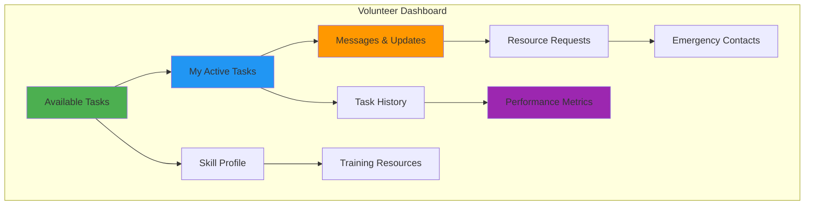
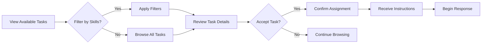
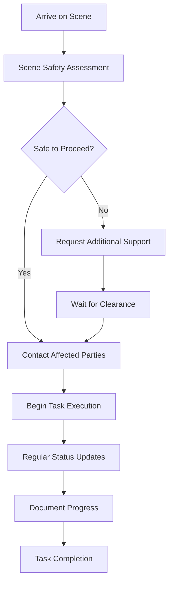
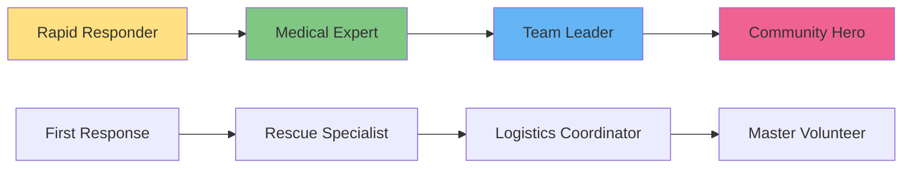

# Volunteers Guide

Complete guide for community volunteers responding to disaster and emergency situations.

## 👋 Welcome, Volunteer!

As a volunteer, you're a crucial part of the disaster response network. This guide will help you:

- **Find and accept tasks** that match your skills
- **Respond effectively** to emergency situations
- **Track your impact** and build expertise
- **Coordinate with others** in the response network
- **Stay safe** while helping others

## 🎯 Volunteer Dashboard Overview

### Your Command Center



### Key Features

**🎯 Smart Task Matching**

- AI matches tasks to your skills and location
- Estimated time and difficulty ratings
- Real-time availability updates

**📍 Location-Based Assignments**

- Tasks sorted by distance from you
- Route planning and navigation
- Traffic and hazard alerts

**🏆 Progress Tracking**

- Points and achievement system
- Performance metrics and feedback
- Skill development recommendations

## 📋 Finding and Accepting Tasks

### Task Discovery

Navigate to **Available Tasks** to see opportunities:



### Task Categories

=== "🏥 Medical Support"

    **Skills Needed**: First aid, CPR, medical training

    **Typical Tasks**:
    - Basic first aid assistance
    - Patient transport support
    - Medical supply delivery
    - Wellness checks

    **What to Expect**:
    - Clear medical protocols
    - Guidance from medical professionals
    - Safety equipment provided
    - Backup support available

=== "⛑️ Rescue Operations"

    **Skills Needed**: Physical fitness, safety training, equipment operation

    **Typical Tasks**:
    - Search and rescue support
    - Evacuation assistance
    - Debris clearing
    - Emergency access creation

    **What to Expect**:
    - Team-based operations
    - Safety briefings required
    - Specialized equipment
    - Professional supervision

=== "🚚 Supply Distribution"

    **Skills Needed**: Organization, logistics, customer service

    **Typical Tasks**:
    - Food and water distribution
    - Emergency supply delivery
    - Inventory management
    - Community outreach

    **What to Expect**:
    - Regular schedules
    - Community interaction
    - Physical activity
    - Team coordination

=== "🏠 Shelter Support"

    **Skills Needed**: Interpersonal skills, crisis support, organization

    **Typical Tasks**:
    - Shelter setup and management
    - Registration and check-in
    - Family services support
    - Comfort and care provision

    **What to Expect**:
    - Emotional situations
    - Long-term assignments
    - Training provided
    - Mental health support

=== "📞 Communication"

    **Skills Needed**: Communication, technology, languages

    **Typical Tasks**:
    - Emergency hotline support
    - Translation services
    - Information coordination
    - Family notification

    **What to Expect**:
    - Remote work possible
    - Shift-based scheduling
    - Training materials
    - Stress management support

### Task Acceptance Process

1. **Review Task Details**

   ```
   Title: Medical Emergency Response
   Location: 123 Main St (2.3 km away)
   Skills Required: First Aid, Patient Care
   Estimated Duration: 45 minutes
   Priority: High
   Equipment Provided: Yes
   Backup Support: Available
   ```

2. **Check Your Availability**

   - Confirm you have the required time
   - Verify transportation to location
   - Ensure no schedule conflicts
   - Check equipment/resource needs

3. **Accept Assignment**

   - Click "Accept Task"
   - Confirm skills and availability
   - Provide estimated arrival time
   - Review safety protocols

4. **Receive Instructions**
   - Contact information
   - Detailed location and access
   - Safety considerations
   - Reporting requirements

## 🎯 Task Execution

### Pre-Response Preparation

**Safety First Checklist**:

- [ ] Review task-specific safety protocols
- [ ] Verify emergency contact information
- [ ] Check equipment and supplies
- [ ] Confirm backup support availability
- [ ] Share location with emergency contact
- [ ] Review evacuation routes

**Equipment Check**:

- [ ] Personal protective equipment (PPE)
- [ ] Communication devices (charged)
- [ ] Task-specific tools
- [ ] First aid supplies
- [ ] Emergency contact list
- [ ] Identification and volunteer credentials

### En Route Protocol

1. **Update Status**: Mark "En Route" in the app
2. **Estimated Arrival**: Provide updated ETA
3. **Communication**: Stay in contact with dispatch
4. **Navigation**: Use provided routes and updates
5. **Safety Awareness**: Monitor for hazards and changes

### On-Scene Response

#### Initial Assessment



#### Safety Protocols

**Always**:

- Assess scene safety before entering
- Use appropriate PPE
- Follow established protocols
- Communicate regularly with dispatch
- Document actions and decisions
- Respect privacy and dignity

**Never**:

- Enter unsafe areas without clearance
- Exceed your training or skill level
- Work alone in dangerous situations
- Share personal information inappropriately
- Take unnecessary risks
- Ignore safety guidelines

### Progress Reporting

**Regular Updates** (every 15-30 minutes):

```json
{
  "status": "in_progress",
  "location": "On scene",
  "progress": "60%",
  "notes": "Patient stabilized, awaiting transport",
  "safety_status": "all_clear",
  "estimated_completion": "15 minutes"
}
```

**Photo Documentation**:

- Situation overview (respecting privacy)
- Work progress
- Resource usage
- Safety concerns
- Before/after conditions

## 💬 Communication and Coordination

### Communication Channels

**Primary**: Mobile app messaging

- Real-time updates
- Photo and location sharing
- Direct contact with affected individuals
- Coordination with other responders

**Secondary**: Phone/SMS

- Emergency situations
- App connectivity issues
- Urgent coordination needs
- Family/emergency contacts

**Emergency**: Radio networks

- Major disasters
- Infrastructure failures
- Backup communication
- Wide-area coordination

### Working with Other Responders

**First Responders** (Professional):

- Follow their lead and instructions
- Provide support as directed
- Share relevant information
- Respect professional protocols

**Other Volunteers**:

- Coordinate activities
- Share resources and information
- Provide mutual support
- Maintain team safety

**Affected Individuals**:

- Listen actively and empathetically
- Respect privacy and choices
- Provide clear information
- Maintain professional boundaries

### Escalation Procedures

**When to Escalate**:

- Safety concerns or hazards
- Medical emergencies beyond your training
- Need for additional resources
- Equipment failures
- Uncooperative or hostile individuals
- Legal or ethical concerns

**How to Escalate**:

1. **Immediate**: Use emergency button in app
2. **Urgent**: Call dispatch or supervisor
3. **Standard**: Send escalation request through app
4. **Documentation**: Record reason and response

## 📊 Performance and Recognition

### Point System

Earn points for:

| Activity            | Base Points | Multipliers         |
| ------------------- | ----------- | ------------------- |
| Complete task       | 20-100      | Priority level      |
| High-quality work   | +25%        | Performance rating  |
| Quick response      | +15%        | Under 15 minutes    |
| Training completion | 50          | Certification level |
| Feedback rating 5⭐ | +10%        | Consistent quality  |
| Emergency response  | 2x          | Critical situations |

### Achievement Badges



**Badge Categories**:

- **Response Speed**: Fast task acceptance and arrival
- **Skill Specialization**: Expertise in specific areas
- **Quality Service**: Consistent high ratings
- **Leadership**: Training and mentoring others
- **Dedication**: Long-term service commitment
- **Innovation**: Creative problem-solving

### Performance Metrics

Track your impact:

**Response Metrics**:

- Average response time
- Task completion rate
- Quality ratings
- Safety record

**Community Impact**:

- People helped
- Tasks completed
- Hours volunteered
- Resources delivered

**Skill Development**:

- Training certifications
- Specialization areas
- Mentoring activities
- Leadership roles

## 🎓 Training and Development

### Required Training

**Basic Volunteer Training** (4 hours):

- Disaster response basics
- Safety protocols
- Communication systems
- Legal and ethical considerations

**Role-Specific Training**:

- Medical: First Aid/CPR certification
- Rescue: Safety and equipment training
- Shelter: Crisis counseling basics
- Communication: Technology and protocols

### Ongoing Education

**Monthly Training Sessions**:

- Skill refreshers
- New procedures
- Case study reviews
- Equipment updates

**Online Learning Modules**:

- Self-paced courses
- Certification programs
- Video training library
- Interactive simulations

**Mentorship Program**:

- Pair with experienced volunteers
- Shadow on complex tasks
- Skill development guidance
- Career pathway support

### Specialization Tracks

**Medical Response Track**:

- Advanced first aid
- Trauma care
- Medical equipment operation
- Patient transport protocols

**Technical Rescue Track**:

- Rope rescue techniques
- Confined space operations
- Vehicle extrication
- Search patterns

**Logistics and Management Track**:

- Supply chain management
- Volunteer coordination
- Resource allocation
- Emergency planning

## 🛡️ Safety and Self-Care

### Personal Safety

**Before Every Response**:

- Get adequate rest
- Eat properly and stay hydrated
- Check weather and conditions
- Inform family/friends of your activities
- Ensure reliable transportation
- Carry emergency supplies

**Physical Safety**:

- Use proper lifting techniques
- Wear appropriate clothing and PPE
- Be aware of environmental hazards
- Work within your physical limits
- Take regular breaks
- Stay properly hydrated

**Emotional Safety**:

- Recognize stress and trauma symptoms
- Use available counseling resources
- Debrief after difficult situations
- Maintain work-life balance
- Connect with support networks
- Take time off when needed

### Mental Health Support

**Available Resources**:

- **Crisis counseling**: 24/7 support line
- **Peer support groups**: Connect with other volunteers
- **Professional counseling**: Referrals and services
- **Stress management**: Workshops and resources
- **Family support**: Services for volunteer families

**Warning Signs to Watch For**:

- Persistent sleep problems
- Increased irritability or anger
- Withdrawal from activities
- Physical symptoms (headaches, fatigue)
- Difficulty concentrating
- Increased substance use

### Work-Life Balance

**Setting Boundaries**:

- Define your availability windows
- Set limits on response frequency
- Take regular breaks from volunteering
- Maintain personal relationships
- Pursue non-emergency activities
- Practice self-care routines

**Family Considerations**:

- Communicate with family about your volunteering
- Include family in volunteer appreciation events
- Use family-friendly volunteer opportunities
- Balance volunteer time with family time
- Address family concerns about safety

## 📞 Resources and Support

### Emergency Contacts

| Contact               | Number   | Purpose                           |
| --------------------- | -------- | --------------------------------- |
| Volunteer Dispatch    | [Number] | Task coordination, emergencies    |
| Volunteer Supervisor  | [Number] | Questions, concerns, issues       |
| Mental Health Hotline | 988      | Crisis counseling, stress support |
| Emergency Services    | 911      | Life-threatening situations       |
| Red Cross Chapter     | [Number] | Resources, additional support     |

### Online Resources

**Volunteer Portal**:

- Training materials
- Policy documents
- Resource libraries
- Community forums

**Mobile App Features**:

- Task management
- GPS navigation
- Emergency contacts
- Offline resources

### Community Support

**Volunteer Groups**:

- Local volunteer chapters
- Skill-based teams
- Social activities
- Recognition events

**Professional Networks**:

- Cross-training opportunities
- Career development
- Professional references
- Skill certifications

## 💡 Tips for Success

### Effective Volunteering

**Best Practices**:

- Arrive prepared and on time
- Communicate clearly and often
- Follow protocols and procedures
- Ask questions when uncertain
- Document your work thoroughly
- Seek feedback and continuous improvement

**Common Mistakes to Avoid**:

- Overcommitting to tasks
- Working beyond skill level
- Ignoring safety protocols
- Poor communication with affected individuals
- Inadequate documentation
- Neglecting self-care

### Building Your Volunteer Career

**Short-term Goals**:

- Complete basic training
- Establish regular volunteering schedule
- Build core competencies
- Develop local network

**Long-term Goals**:

- Pursue specialized training
- Take on leadership roles
- Mentor new volunteers
- Contribute to policy development

---

## 🌟 Remember: Every Response Makes a Difference

Your willingness to serve makes you a hero in your community. Every task completed, every person helped, and every skill developed contributes to building a more resilient and caring society.

---

_Questions? Contact volunteer support or check the [FAQ section](../troubleshooting.md#volunteer-questions)_
